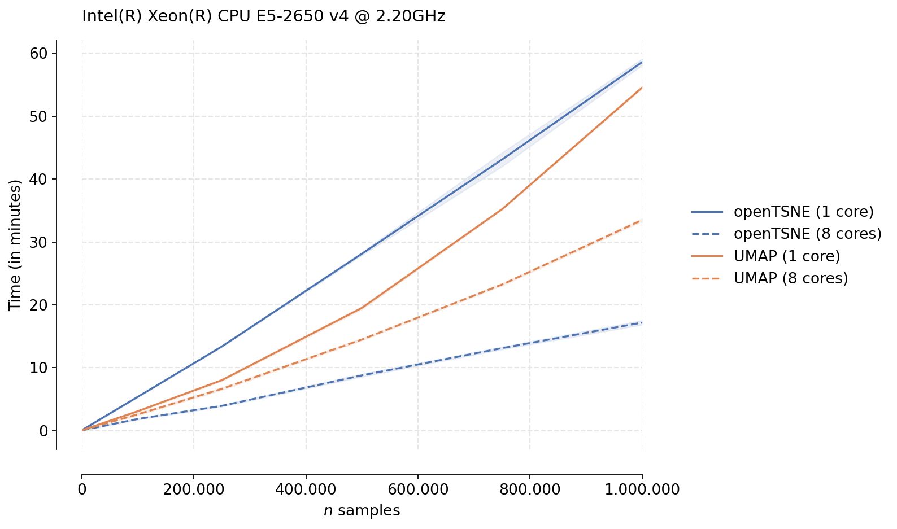

Benchmarks
==========

Comparison to other t-SNE implementations
-----------------------------------------

We benchmark openTSNE (v0.6.0) against three popular open-source implementations from scikit-learn (v0.24.2), MulticoreTSNE (v0.1), and FIt-SNE (v1.2.1). The benchmarks were run on a server-grade Intel Xeon E5-2650 processor. To generate benchmark data sets of different sizes, we subsampled data from the 10X Genomics 1.3 million mouse brain data set five times, resulting in five different data sets for each size.  In total, we run each implementation on 30 different data sets.

For each run, five separate datasets were generated by sampling from the 10X 1.3 Million Brain Cells dataset (available `here <https://support.10xgenomics.com/single-cell-gene-expression/datasets>`_). We reduce the number of dimensions to 50 principal components, following the standard single-cell pipeline. Each t-SNE implementation was then run on every dataset using the following parameters: ``perplexity=30, learning_rate=200`` for 250 early exaggeration iterations with exaggeration 12 and 750 standard iterations with exaggeration 1. Other parameters were set to their default values. This was then repeated for different sample sizes (1,000, 100k, 250k, 500k, 750k, 1mln) resulting in 30 runs for each implementation.

.. figure:: images/benchmarks.png
    :width: 100%
    :align: center

We can immediately see the differences between the different t-SNE approximation schemes used by different algorithms. Both MulticoreTSNE and scikit-learn use the Barnes-Hut approximation by default with O(N log N) scaling. On the other hand, FIt-SNE and openTSNE both make use of the FIt-SNE approximation algorithm with linear time complexity, which is clearly visible from the figure.

While the Python runtime inevtiably incurrs some overhead, making openTSNE slightly slower than FIt-SNE, both implementations have comparable runtimes. openTSNE makes this slight performance trade-off for the benefit of ease of installation and a much more flexible and familliar API.

Comparison to UMAP
-------------------------------

UMAP is another widely popular dimensionality reduction technique. We here benchmark openTSNE (v0.6.0) to umap-learn (v0.5.1), the most popular publicly available Python UMAP implementation. We use the same setup as before, downsampling the 10X Genomics mouse brain data set five times. Because UMAP makes use of numba and requires JIT compilation, we add an additional warmup run to ensure a fair comparison. Different from before, we run t-SNE with the default parameters, decreasing the number of total iterations to 750 and using the automatic learning rate.

We see that while UMAP in indeed faster in the single-threaded case, openTSNE tends to perform much better in the multi-threaded scenario. This is likely due to the fact that the optimization phase of UMAP is not parallelizable, while openTSNE makes heavy use of parallelism in every stage of the algorithm. We see that for large data sets, openTSNE is almost twice as fast as UMAP with clear linear scaling. Somewhat surprising is the single-threaded UMAP trend. While it is clearly faster than openTSNE, the scaling does not appear to be linear, like the scaling exhibited by openTSNE, indicating that openTSNE may be faster than UMAP even in the single-threaded case for larger data sets.

Another caveat is that for large data sets, it is highly recommended to increase the `exaggeration` parameter in t-SNE. This creates cleaner embeddings with good separation. These embeddings are fairly similar to the embeddings produced by UMAP. However, openTSNE actually runs `faster` when increasing the exaggeration. Therefore, in practice, the speed differences between openTSNE and UMAP are likely even greater. However, we run the algorithms here with default parameters to ensure a fair comparison.

In practice, virtually every computer contains multiple cores. For example, consumer grade Intel i7 processors commonly have 8 cores, making the multi-threaded case more relevant to the majority of users.

Caveats when running benchmarks
-------------------------------

When running benchmarks on machines with multiple cores using Intel's Math Kernel Library (MKL), care must be taken to properly limit the number of threads available. The number of threads should be limited by setting the environmental variable ``OMP_NUM_THREADS=X``, where ``X`` is the number of threads. This is important when using a numpy distribution linked against the MKL. Both openTSNE and scikit-learn make heavy use of numpy. By default, the MKL will use all available cores by default, ignoring the user-defined ``n_jobs`` parameters. Failure to do so will allow MKL to use all available cores, resulting in an unfair comparison.

Similarly, care must be taken when benchmarking against numba-dependent libraries e.g. umap-learn. In addition to specifying ``OMP_NUM_THREADS=X``, we must also specify the ``NUMBA_NUM_THREADS=X`` environmental variable. Failure to do so will allow numba to use all available cores, resulting in an unfair comparison. Additionally, each numba-dependent library should be run for a *warm-up* round so numba can perform its bytecode compilation without negatively affecting the benchmarks. Failure to do so will result in the first run being noticeably slower, skewing the overall results.

Reproducibility
---------------

All benchmarks were run on an Intel(R) Xeon(R) CPU E5-2650 v4 @ 2.20GHz processor. We also ran a subset of these benchmarks on a consumer-grade Intel Core i7-7700HQ processor found in laptop computers. The general trends were similar. All benchmarks were run using the provided benchmark script in the openTSNE repository ``openTSNE/benchmarks/benchmark.py``. The data set used can be found in the example notebooks. A direct link to the preprocessed pickled matrix file is available at ``http://file.biolab.si/opentsne/benchmark/10x_mouse_zheng.pkl.gz``.
