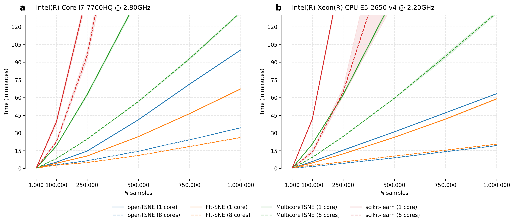

Benchmarks
==========

We performed benchmarks for several popular t-SNE implementations. Benchmarks were run on a
Intel(R) Core(TM) i7-4790K CPU @ 4.00GHz processor.

We repeated each run three times. The data were subsampled from the 10X 1.3 Million Brain Cells from E18 Mice (available `here <https://support.10xgenomics.com/single-cell-gene-expression/datasets>`_).

