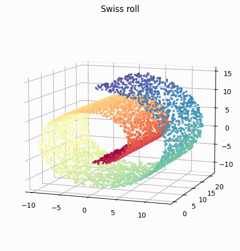
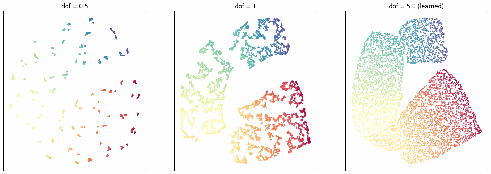
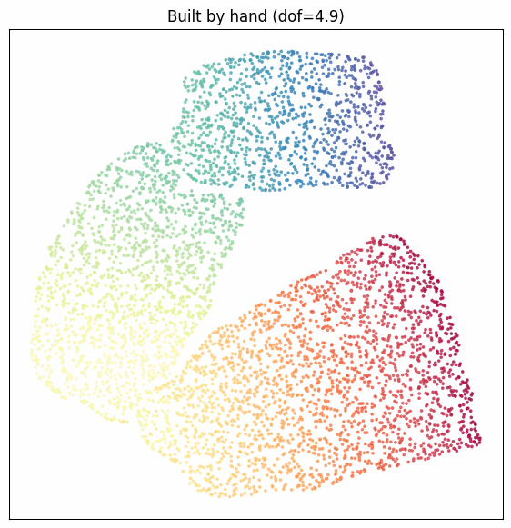
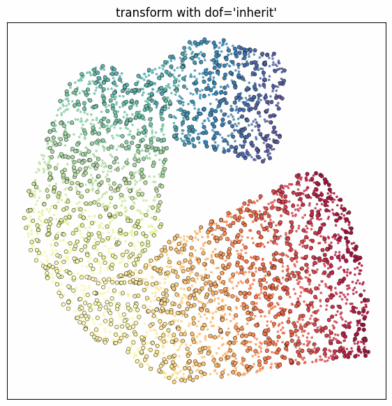
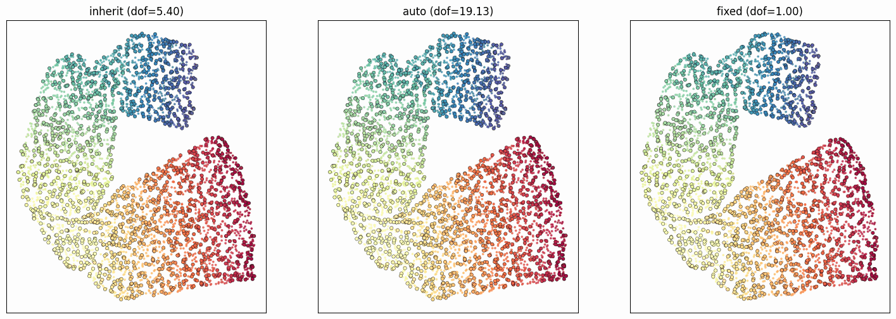
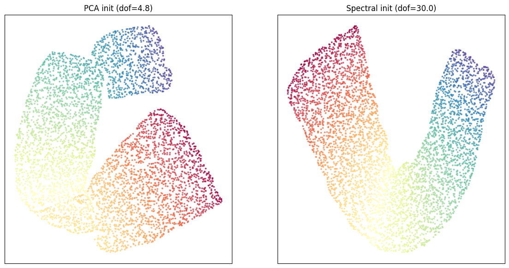

.. _degrees-of-freedom:

Degrees of freedom
==================

The degrees of freedom :math:`\alpha` (sometimes called ``dof`` or :math:`\nu`)
control the heaviness of the tails of the t-SNE kernel. openTSNE uses the
heavy-tailed kernel of Kobak et al. [1]_

.. math::

    k(\mathbf{y}_i, \mathbf{y}_j) =
    \left( 1 + \frac{\lVert \mathbf{y}_i - \mathbf{y}_j \rVert^2}{\alpha} \right)^{-\alpha} .

With :math:`\alpha = 1` the expression simplifies to the standard Student-t
kernel used in ordinary t-SNE,

.. math::

    k(\mathbf{y}_i, \mathbf{y}_j) =
    \left( 1 + \lVert \mathbf{y}_i - \mathbf{y}_j \rVert^2 \right)^{-1} ,

which is the default. openTSNE evaluates this simpler form directly whenever
:math:`\alpha = 1` and only falls back to the general kernel for other values.
Lowering :math:`\alpha` makes the tails heavier, which tends to pull apart
clusters and reveal finer structure, while larger values produce a more
Gaussian-like kernel. Choosing a good value by hand can be tedious, so openTSNE
can also *learn* the degrees of freedom during optimization.

The ``dof`` parameter and the ``dof_`` attribute
------------------------------------------------

Two related names appear throughout the API, and it helps to keep them apart:

``dof``
    A parameter that tells openTSNE *how* to treat the degrees of freedom on a
    given call. It may be a number, in which case the degrees of freedom are
    held **fixed** at that value, or the string ``"auto"``, in which case they
    are **learned** during optimization. A third value, ``"inherit"``, is
    available when adding new data and is described below.

``dof_``
    An attribute on every embedding holding the degrees of freedom that were
    actually used. After optimization this is the value the kernel was
    evaluated with: the fixed value for a fixed ``dof``, or the learned value
    for ``dof="auto"``. You can always read ``embedding.dof_`` without having to
    know which mode was used.

    The trailing underscore follows the scikit-learn convention for attributes
    that are set as a result of fitting, like :attr:`~openTSNE.TSNEEmbedding.kl_divergence_`:
    it marks ``dof_`` as something the library computes for you, not something
    you configure.

In short, ``dof`` is the *instruction* and ``dof_`` is the *result*.

.. warning::

    Unlike most fitted attributes, ``dof_`` is not purely informational.
    openTSNE reads it back to decide where to continue from: a subsequent
    ``dof="auto"`` optimization warm-starts from ``embedding.dof_``, and
    :meth:`~openTSNE.TSNEEmbedding.transform` with the default
    ``dof="inherit"`` pins new points at the parent's ``dof_``. Overwriting
    ``embedding.dof_`` by hand therefore changes later optimization and
    transforms — it is not a cosmetic relabelling. To run with a different
    value, pass ``dof`` to :meth:`~openTSNE.TSNEEmbedding.optimize` or
    :class:`~openTSNE.TSNE` rather than assigning to ``dof_``.

Standard t-SNE
--------------

By default the degrees of freedom are fixed at ``1``, giving ordinary t-SNE:

.. code-block:: python

    from openTSNE import TSNE

    embedding = TSNE().fit(x)        # dof=1, standard t-SNE
    embedding.dof_                   # 1.0

A fixed, lower value yields a heavier-tailed kernel:

.. code-block:: python

    embedding = TSNE(dof=0.5).fit(x)
    embedding.dof_                   # 0.5

To let t-SNE find a suitable value on its own, set ``dof="auto"``. The learned
value is written to ``dof_`` once optimization finishes:

.. code-block:: python

    embedding = TSNE(dof="auto").fit(x)
    embedding.dof_                   # e.g. 0.73, the learned value

When learning, optimization starts from ``1`` by default. A different starting
point can be supplied with ``initial_dof``:

.. code-block:: python

    embedding = TSNE(dof="auto", initial_dof=2).fit(x)

``initial_dof`` only applies when ``dof="auto"``; it is ignored (with a warning)
for a fixed ``dof``.

.. note::

    Learning the degrees of freedom is supported with both the Barnes-Hut
    (``negative_gradient_method="bh"``) and the interpolation-based FFT
    (``negative_gradient_method="fft"``) gradients. The one exception is
    embedding new points into an existing embedding
    (:meth:`~openTSNE.TSNEEmbedding.transform`): there only Barnes-Hut computes
    the dof gradient, and the FFT path keeps the degrees of freedom fixed and
    emits a warning.

Optimizing in phases
~~~~~~~~~~~~~~~~~~~~~~

Embeddings can be optimized incrementally with
:meth:`~openTSNE.TSNEEmbedding.optimize`, and the degrees of freedom carry over
between calls. The ``dof`` mode chosen when the embedding was created is
remembered, so there is no need to repeat it: a further ``optimize`` call simply
continues learning from where the previous one left off, with ``dof_`` recording
the current value.

.. code-block:: python

    embedding = TSNE(dof="auto").fit(x)   # embedding.dof_ holds the learned value
    embedding = embedding.optimize(250)   # continues learning from embedding.dof_

The same applies when constructing an embedding by hand rather than through the
:class:`~openTSNE.TSNE` estimator. The starting value lives on the embedding,
so a freshly built ``dof="auto"`` embedding learns from ``1`` (or from
``initial_dof``), and each further call resumes from the value learned so far:

.. code-block:: python

    from openTSNE import TSNEEmbedding, affinity, initialization

    affinities = affinity.PerplexityBasedNN(x, perplexity=30)
    init = initialization.pca(x)

    embedding = TSNEEmbedding(init, affinities, dof="auto", negative_gradient_method="bh")
    embedding = embedding.optimize(250, exaggeration=12)
    embedding = embedding.optimize(500)

Passing a number on any call fixes the degrees of freedom at that value for the
run. This is the natural way to freeze a learned value before continuing:

.. code-block:: python

    embedding = TSNE(dof="auto").fit(x)               # learns, e.g. dof_ == 0.73
    embedding = embedding.optimize(250, dof=embedding.dof_)   # freeze at 0.73

Adding new data
---------------

When embedding new points into an existing embedding with
:meth:`~openTSNE.TSNEEmbedding.transform` (or
:meth:`~openTSNE.TSNEEmbedding.prepare_partial`), the ``dof`` parameter accepts
the same numeric and ``"auto"`` values, plus a third option, ``"inherit"``,
which is the default. The new points should normally live in the same kernel as
the reference embedding, so by default they take the parent's degrees of freedom
and keep them fixed.

.. code-block:: python

    embedding = TSNE(dof="auto").fit(x)   # embedding.dof_ == 0.73, say

    # Default: inherit the parent's degrees of freedom, held fixed
    new = embedding.transform(x_new)
    new.dof_                              # 0.73

The other modes mirror the standard case. Setting ``dof="auto"`` learns a
separate value for the new points, warm-started from the parent's value so the
optimization continues smoothly:

.. code-block:: python

    new = embedding.transform(x_new, dof="auto")          # starts at 0.73, then learns

The warm-start can be overridden with ``initial_dof``:

.. code-block:: python

    new = embedding.transform(x_new, dof="auto", initial_dof=5)   # starts at 5, then learns

Finally, a number pins the new points to a specific value, ignoring the parent:

.. code-block:: python

    new = embedding.transform(x_new, dof=3)
    new.dof_                              # 3.0

.. warning::

    Learning the degrees of freedom for new points (``dof="auto"`` on
    ``transform``) is uncharted territory and should be used at your own risk.
    With the reference embedding held fixed, the objective has no interior
    optimum in the degrees of freedom — it keeps improving slightly as they
    grow, with sharply diminishing returns — so the learned value drifts upward
    with more iterations rather than settling. openTSNE emits a warning when
    this mode is used. ``"inherit"`` (the default) is recommended.

The four behaviours can be summarized as follows.

.. list-table::
   :header-rows: 1
   :widths: 35 65

   * - ``dof`` on ``transform``
     - Behaviour
   * - ``"inherit"`` *(default)*
     - Use the parent's ``dof_``, held fixed.
   * - ``"auto"``
     - Learn a new value, warm-started from the parent.
   * - ``"auto"`` with ``initial_dof``
     - Learn a new value, warm-started from ``initial_dof``.
   * - a number
     - Hold the degrees of freedom fixed at that number.

A worked example: the Swiss roll
--------------------------------

The effect of the degrees of freedom is easiest to see on the *Swiss roll*: a
two-dimensional sheet rolled up in three dimensions. Because it is a single
continuous manifold rather than a set of clusters, it makes a good test of how
the tail heaviness reshapes an embedding. We colour each point by its position
``t`` along the roll, so that a faithful embedding unrolls the sheet while
keeping the colour gradient continuous.

.. code-block:: python

    from sklearn.datasets import make_swiss_roll

    x, t = make_swiss_roll(n_samples=5000, noise=0.05, random_state=42)

A heavier-tailed kernel (small ``dof``) pulls neighbouring points apart. On
clustered data this helps to separate clusters, but on a continuous manifold it
tears the sheet into fragments. A lighter-tailed kernel keeps it together, and
letting openTSNE choose with ``dof="auto"`` recovers a fairly large value here —
around ``5`` — reflecting that the Swiss roll should stay connected:

.. code-block:: python

    from openTSNE import TSNE

    heavy    = TSNE(dof=0.5, random_state=42).fit(x)
    standard = TSNE(dof=1, random_state=42).fit(x)
    learned  = TSNE(dof="auto", random_state=42).fit(x)

    learned.dof_   # ~5.0

Side by side, the three embeddings show the progression from a fragmented
heavy-tailed embedding, through standard t-SNE, to the smooth unrolled sheet
recovered with the learned degrees of freedom.

Building the embedding by hand
~~~~~~~~~~~~~~~~~~~~~~~~~~~~~~~~

The estimator above is a convenient wrapper. For finer control the affinities,
the initialization, and the optimizer can be assembled directly and optimized in
phases. The ``dof`` mode can even be varied between phases. Here we hold
``dof=1`` (standard t-SNE) during early exaggeration, while the broad layout of
the manifold forms, and only switch on learning with ``dof="auto"`` for the main
phase. Passing ``dof="auto"`` to a single
:meth:`~openTSNE.TSNEEmbedding.optimize` call overrides the embedding's mode for
that call, so the degrees of freedom start learning from their current value of
``1``.

.. code-block:: python

    from openTSNE import TSNEEmbedding, affinity, initialization

    affinities = affinity.PerplexityBasedNN(x, perplexity=30, random_state=42)
    init = initialization.pca(x, random_state=42)

    # Construct with the default dof=1, i.e. standard t-SNE
    embedding = TSNEEmbedding(
        init, affinities, negative_gradient_method="bh", random_state=42
    )
    embedding = embedding.optimize(250, exaggeration=12)   # dof held fixed at 1
    embedding = embedding.optimize(500, dof="auto")        # main phase: learn dof
    embedding.dof_                                         # ~4.9

Holding ``dof=1`` through early exaggeration lets the broad structure settle
under the familiar t-SNE kernel; learning then refines the degrees of freedom to
about ``5`` during the main phase, recovering the same light-tailed kernel the
estimator finds.

Embedding new points
~~~~~~~~~~~~~~~~~~~~~~

Finally, we map unseen points into an existing embedding. We split the swiss
roll into a reference set, which we embed first, and a set of new points, which
we then place into that same space with
:meth:`~openTSNE.TSNEEmbedding.transform`.

.. code-block:: python

    from sklearn.model_selection import train_test_split

    x_ref, x_new, t_ref, t_new = train_test_split(x, t, test_size=0.33, random_state=42)

    reference = TSNE(dof="auto", random_state=42).fit(x_ref)
    reference.dof_                        # ~5.4

By default ``transform`` uses ``dof="inherit"``: the new points adopt the
reference's degrees of freedom and hold them fixed, so they live in exactly the
same kernel as the points they are mapped against.

.. code-block:: python

    new = reference.transform(x_new)      # dof="inherit" by default
    new.dof_                              # 5.4, inherited from the reference

The new points (outlined) slot smoothly into the reference (drawn faintly),
continuing its colour gradient. The other modes behave as described above:
``dof="auto"`` relearns a value for the new points, and a number pins them to a
fixed value. Because ``"auto"`` is only weakly identified against a fixed
reference it tends to a larger value here (around ``19``), while a fixed
``dof=1`` deliberately uses a heavier-tailed kernel than the reference. In all
three cases the embedding itself is barely affected — the choice of ``dof`` for
new points changes the learned value far more than where the points land.

.. code-block:: python

    new_inherit = reference.transform(x_new)               # 5.4
    new_auto    = reference.transform(x_new, dof="auto")   # ~19, drifts upward
    new_fixed   = reference.transform(x_new, dof=1)        # 1.0

A better initialization
~~~~~~~~~~~~~~~~~~~~~~~~~

Everything above used the default ``initialization="pca"``. For the Swiss roll
this is a poor starting point: PCA simply projects the three-dimensional spiral
onto its plane of greatest variance, so the embedding *begins* already rolled
up, with layers of the sheet stacked on top of one another. t-SNE's local
objective rarely undoes a global fold like this, which is why the learned
embeddings above keep distant parts of the colour gradient (blue and red)
folded back against each other rather than laid out in a clean rectangle.

Spectral initialization instead places points using the leading eigenvectors of
the KNN graph, which follow the manifold rather than the ambient geometry. The
embedding therefore *starts* unrolled, and optimization only has to refine it:

.. code-block:: python

    spectral = TSNE(initialization="spectral", dof="auto", random_state=0).fit(x)
    spectral.dof_   # ~30

Starting from the unrolled spectral layout, the sheet now stays unrolled: the
colour gradient runs smoothly from one end to the other across a single
continuous band, without folding back on itself the way the PCA-initialized
result does. The optimizer also drives ``dof`` up to a much larger, almost
Gaussian value here — light tails that hold the connected manifold together
rather than tearing it apart. For a manifold like the Swiss roll a good
initialization matters at least as much as the kernel, and spectral
initialization is the better choice.

References
----------

.. [1] Kobak, Dmitry, et al. `"Heavy-tailed kernels reveal a finer cluster
   structure in t-SNE visualisations"
   <https://link.springer.com/chapter/10.1007/978-3-030-46150-8_8>`__,
   ECML PKDD (2019).
