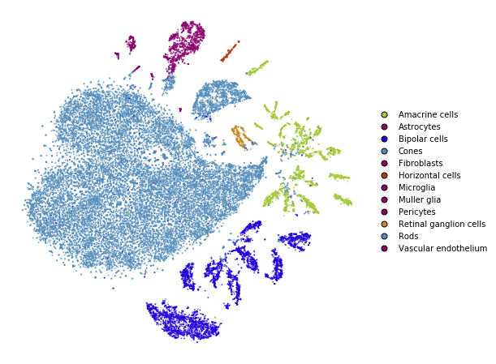
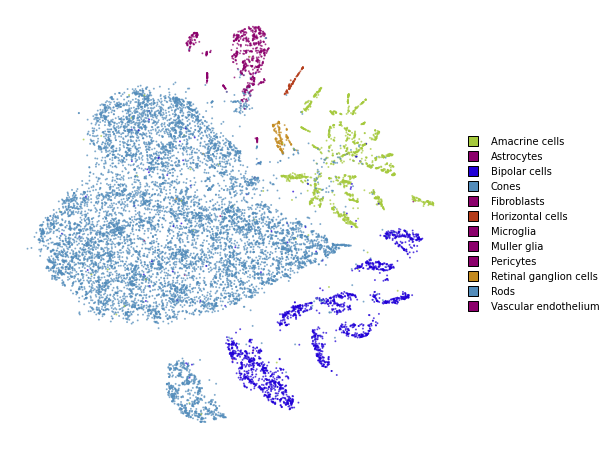
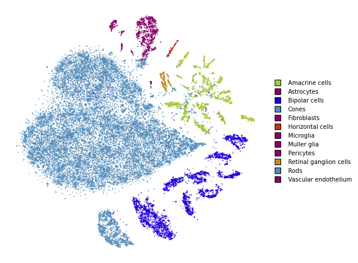

Simple usage
============

This notebook demonstrates basic usage of the *openTSNE* library. This
is sufficient for almost all use-cases.

.. code:: ipython3

    from openTSNE import TSNE
    from openTSNE.callbacks import ErrorLogger
    
    from examples import utils
    
    import numpy as np
    from sklearn.model_selection import train_test_split
    
    import matplotlib.pyplot as plt

Load data
---------

In most of the notebooks, we will be using the Macosko 2015 mouse retina
data set. This is a fairly well-known and well explored data set in the
single-cell literature making it suitable as an example.

.. code:: ipython3

    import gzip
    import pickle
    
    with gzip.open("data/macosko_2015.pkl.gz", "rb") as f:
        data = pickle.load(f)
    
    x = data["pca_50"]
    y = data["CellType1"].astype(str)

.. code:: ipython3

    print("Data set contains %d samples with %d features" % x.shape)

.. parsed-literal::

    Data set contains 44808 samples with 50 features

Create train/test split
-----------------------

.. code:: ipython3

    x_train, x_test, y_train, y_test = train_test_split(x, y, test_size=.33, random_state=42)

.. code:: ipython3

    print("%d training samples" % x_train.shape[0])
    print("%d test samples" % x_test.shape[0])

.. parsed-literal::

    30021 training samples
    14787 test samples

Run t-SNE
---------

We’ll first create an embedding on the training data.

.. code:: ipython3

    tsne = TSNE(
        perplexity=30,
        metric="euclidean",
        callbacks=ErrorLogger(),
        n_jobs=8,
        random_state=42,
    )

.. code:: ipython3

    %time embedding_train = tsne.fit(x_train)

.. parsed-literal::

    Iteration   50, KL divergence  5.7889, 50 iterations in 1.2277 sec
    Iteration  100, KL divergence  5.2496, 50 iterations in 1.1978 sec
    Iteration  150, KL divergence  5.1563, 50 iterations in 1.1671 sec
    Iteration  200, KL divergence  5.1203, 50 iterations in 1.3511 sec
    Iteration  250, KL divergence  5.1018, 50 iterations in 1.4377 sec
    Iteration   50, KL divergence  3.7958, 50 iterations in 1.5298 sec
    Iteration  100, KL divergence  3.4076, 50 iterations in 1.3780 sec
    Iteration  150, KL divergence  3.1945, 50 iterations in 1.3263 sec
    Iteration  200, KL divergence  3.0541, 50 iterations in 1.5235 sec
    Iteration  250, KL divergence  2.9521, 50 iterations in 2.1700 sec
    Iteration  300, KL divergence  2.8745, 50 iterations in 2.4172 sec
    Iteration  350, KL divergence  2.8131, 50 iterations in 3.0004 sec
    Iteration  400, KL divergence  2.7642, 50 iterations in 3.9832 sec
    Iteration  450, KL divergence  2.7241, 50 iterations in 4.3934 sec
    Iteration  500, KL divergence  2.6918, 50 iterations in 5.2797 sec
    Iteration  550, KL divergence  2.6655, 50 iterations in 7.8413 sec
    Iteration  600, KL divergence  2.6441, 50 iterations in 5.8196 sec
    Iteration  650, KL divergence  2.6264, 50 iterations in 6.7464 sec
    Iteration  700, KL divergence  2.6121, 50 iterations in 9.0360 sec
    Iteration  750, KL divergence  2.6002, 50 iterations in 10.0276 sec
    CPU times: user 34min 49s, sys: 41.8 s, total: 35min 31s
    Wall time: 1min 32s

.. code:: ipython3

    utils.plot(embedding_train, y_train, colors=utils.MACOSKO_COLORS)

Transform
---------

openTSNE is currently the only library that allows embedding new points
into an existing embedding.

.. code:: ipython3

    %time embedding_test = embedding_train.transform(x_test)

.. parsed-literal::

    Iteration   50, KL divergence  214515.0279, 50 iterations in 11.2446 sec
    Iteration   50, KL divergence  204042.5486, 50 iterations in 11.1324 sec
    CPU times: user 4min 13s, sys: 4.9 s, total: 4min 17s
    Wall time: 24.2 s

.. code:: ipython3

    utils.plot(embedding_test, y_test, colors=utils.MACOSKO_COLORS)

Together
--------

We superimpose the transformed points onto the original embedding with
larger opacity.

.. code:: ipython3

    fig, ax = plt.subplots(figsize=(8, 8))
    utils.plot(embedding_train, y_train, colors=utils.MACOSKO_COLORS, alpha=0.25, ax=ax)
    utils.plot(embedding_test, y_test, colors=utils.MACOSKO_COLORS, alpha=0.75, ax=ax)

