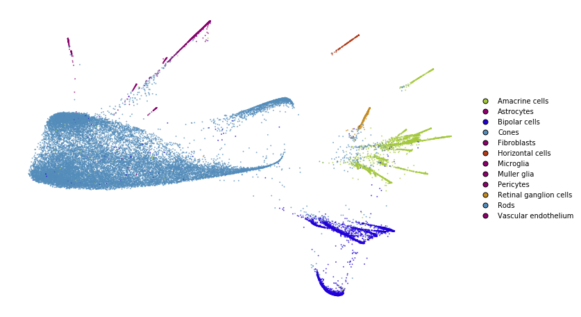
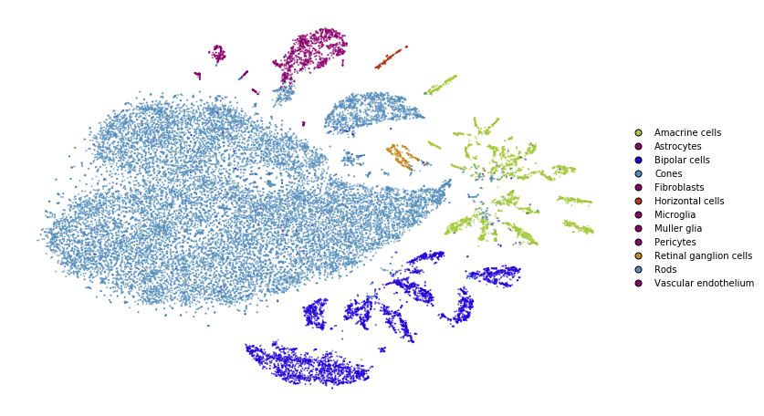
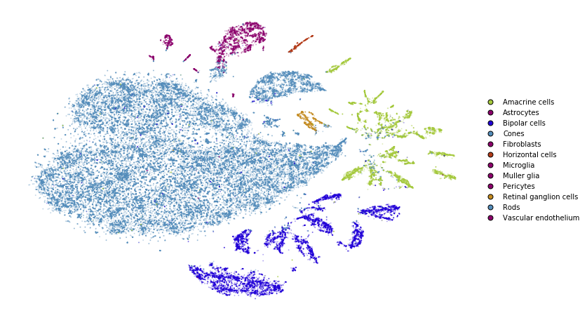

Advanced usage
==============

This notebook replicates what was done in the *simple_usage* notebooks,
but this time with the advanced API. The advanced API is required if we
want to use non-standard affinity methods that better preserve global
structure.

If you are comfortable with the advanced API, please refer to the
*preserving_global_structure* notebook for a guide how obtain better
embeddings and preserve more global structure.

.. code:: python

    from openTSNE import TSNEEmbedding
    from openTSNE.affinity import PerplexityBasedNN
    from openTSNE import initialization
    from openTSNE.callbacks import ErrorLogger
    
    from examples import utils
    
    import numpy as np
    from sklearn.model_selection import train_test_split
    
    import matplotlib.pyplot as plt

Load data
---------

.. code:: python

    import gzip
    import pickle
    
    with gzip.open("data/macosko_2015.pkl.gz", "rb") as f:
        data = pickle.load(f)
    
    x = data["pca_50"]
    y = data["CellType1"].astype(str)

.. code:: python

    print("Data set contains %d samples with %d features" % x.shape)

.. code-block:: text

    Data set contains 44808 samples with 50 features

Create train/test split
-----------------------

.. code:: python

    x_train, x_test, y_train, y_test = train_test_split(x, y, test_size=.33, random_state=42)

.. code:: python

    print("%d training samples" % x_train.shape[0])
    print("%d test samples" % x_test.shape[0])

.. code-block:: text

    30021 training samples
    14787 test samples

Create a t-SNE embedding
------------------------

Like in the *simple_usage* notebook, we will run the standard t-SNE
optimization.

This example shows the standard t-SNE optimization. Much can be done in
order to better preserve global structure and improve embedding quality.
Please refer to the *preserving_global_structure* notebook for some
examples.

**1. Compute the affinities between data points**

.. code:: python

    %%time
    affinities_train = PerplexityBasedNN(
        x_train,
        perplexity=30,
        metric="euclidean",
        n_jobs=8,
        random_state=42,
    )

.. code-block:: text

    CPU times: user 27 s, sys: 291 ms, total: 27.3 s
    Wall time: 14 s

**2. Generate initial coordinates for our embedding**

.. code:: python

    %time init_train = initialization.pca(x_train, random_state=42)

.. code-block:: text

    CPU times: user 330 ms, sys: 3.59 ms, total: 333 ms
    Wall time: 57.6 ms

**3. Construct the ``TSNEEmbedding`` object**

.. code:: python

    embedding_train = TSNEEmbedding(
        init_train,
        affinities_train,
        negative_gradient_method="fft",
        n_jobs=8,
        callbacks=ErrorLogger(),
    )

**4. Optimize embedding**

1. Early exaggeration phase

.. code:: python

    %time embedding_train_1 = embedding_train.optimize(n_iter=250, exaggeration=12, momentum=0.5)

.. code-block:: text

    Iteration   50, KL divergence  5.7901, 50 iterations in 1.0475 sec
    Iteration  100, KL divergence  5.2511, 50 iterations in 1.0043 sec
    Iteration  150, KL divergence  5.1615, 50 iterations in 1.0565 sec
    Iteration  200, KL divergence  5.1268, 50 iterations in 1.0170 sec
    Iteration  250, KL divergence  5.1076, 50 iterations in 1.2683 sec
    CPU times: user 40.9 s, sys: 56.9 ms, total: 40.9 s
    Wall time: 5.44 s

.. code:: python

    utils.plot(embedding_train_1, y_train, colors=utils.MACOSKO_COLORS)

2. Regular optimization

.. code:: python

    %time embedding_train_2 = embedding_train_1.optimize(n_iter=750, momentum=0.8)

.. code-block:: text

    Iteration   50, KL divergence  3.8025, 50 iterations in 1.0494 sec
    Iteration  100, KL divergence  3.4117, 50 iterations in 1.5276 sec
    Iteration  150, KL divergence  3.1974, 50 iterations in 1.2736 sec
    Iteration  200, KL divergence  3.0556, 50 iterations in 1.5149 sec
    Iteration  250, KL divergence  2.9535, 50 iterations in 1.8840 sec
    Iteration  300, KL divergence  2.8751, 50 iterations in 2.0449 sec
    Iteration  350, KL divergence  2.8137, 50 iterations in 2.5758 sec
    Iteration  400, KL divergence  2.7644, 50 iterations in 3.6110 sec
    Iteration  450, KL divergence  2.7245, 50 iterations in 3.3357 sec
    Iteration  500, KL divergence  2.6918, 50 iterations in 3.8583 sec
    Iteration  550, KL divergence  2.6652, 50 iterations in 5.1996 sec
    Iteration  600, KL divergence  2.6436, 50 iterations in 4.6867 sec
    Iteration  650, KL divergence  2.6260, 50 iterations in 5.3286 sec
    Iteration  700, KL divergence  2.6112, 50 iterations in 6.6168 sec
    Iteration  750, KL divergence  2.5991, 50 iterations in 7.2093 sec
    CPU times: user 6min 36s, sys: 455 ms, total: 6min 36s
    Wall time: 51.9 s

.. code:: python

    utils.plot(embedding_train_2, y_train, colors=utils.MACOSKO_COLORS)

Transform
---------

.. code:: python

    %%time
    embedding_test = embedding_train_2.prepare_partial(
        x_test,
        initialization="median",
        k=25,
        perplexity=5,
    )

.. code-block:: text

    CPU times: user 1.93 s, sys: 8 µs, total: 1.93 s
    Wall time: 801 ms

.. code:: python

    utils.plot(embedding_test, y_test, colors=utils.MACOSKO_COLORS)

.. image:: output_24_0.png

.. code:: python

    %%time
    embedding_test_1 = embedding_test.optimize(
        n_iter=100,
        learning_rate=1,
        exaggeration=2,
        momentum=0,
    )

.. code-block:: text

    Iteration   50, KL divergence  212552.5028, 50 iterations in 6.6991 sec
    Iteration  100, KL divergence  212498.8526, 50 iterations in 6.2299 sec
    CPU times: user 1min 34s, sys: 89.6 ms, total: 1min 34s
    Wall time: 13.1 s

.. code:: python

    utils.plot(embedding_test_1, y_test, colors=utils.MACOSKO_COLORS)

.. image:: output_26_0.png

Together
--------

We superimpose the transformed points onto the original embedding with
larger opacity.

.. code:: python

    fig, ax = plt.subplots(figsize=(12, 8))
    utils.plot(embedding_train_2, y_train, colors=utils.MACOSKO_COLORS, alpha=0.25, ax=ax)
    utils.plot(embedding_test_1, y_test, colors=utils.MACOSKO_COLORS, alpha=0.75, ax=ax)

