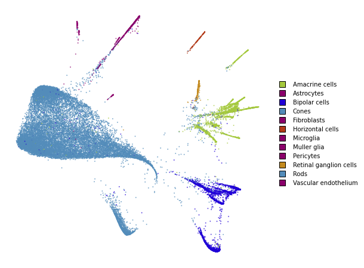
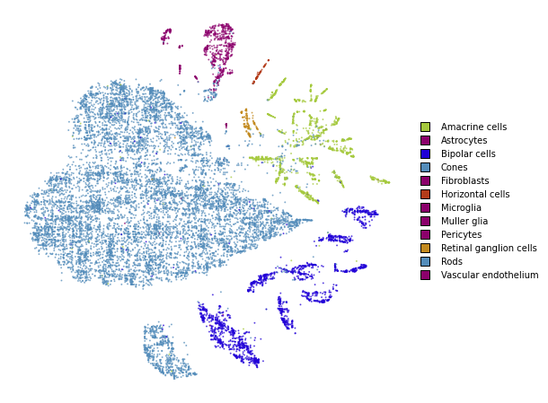
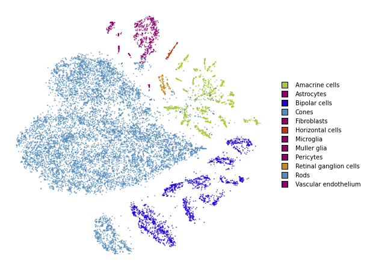
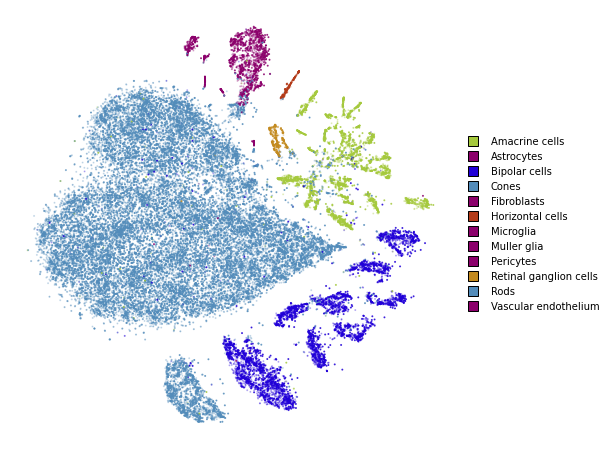

Advanced usage
==============

This notebook replicates what was done in the *simple_usage* notebooks,
but this time with the advanced API. The advanced API is required if we
want to use non-standard affinity methods that better preserve global
structure.

If you are comfortable with the advanced API, please refer to the
*preserving_global_structure* notebook for a guide how obtain better
embeddings and preserve more global structure.

.. code:: ipython3

    from openTSNE import TSNEEmbedding
    from openTSNE.affinity import PerplexityBasedNN
    from openTSNE import initialization
    from openTSNE.callbacks import ErrorLogger
    
    from examples import utils
    
    import numpy as np
    from sklearn.model_selection import train_test_split
    
    import matplotlib.pyplot as plt

Load data
---------

.. code:: ipython3

    import gzip
    import pickle
    
    with gzip.open("data/macosko_2015.pkl.gz", "rb") as f:
        data = pickle.load(f)
    
    x = data["pca_50"]
    y = data["CellType1"].astype(str)

.. code:: ipython3

    print("Data set contains %d samples with %d features" % x.shape)

.. parsed-literal::

    Data set contains 44808 samples with 50 features

Create train/test split
-----------------------

.. code:: ipython3

    x_train, x_test, y_train, y_test = train_test_split(x, y, test_size=.33, random_state=42)

.. code:: ipython3

    print("%d training samples" % x_train.shape[0])
    print("%d test samples" % x_test.shape[0])

.. parsed-literal::

    30021 training samples
    14787 test samples

Create a t-SNE embedding
------------------------

Like in the *simple_usage* notebook, we will run the standard t-SNE
optimization.

This example shows the standard t-SNE optimization. Much can be done in
order to better preserve global structure and improve embedding quality.
Please refer to the *preserving_global_structure* notebook for some
examples.

**1. Compute the affinities between data points**

.. code:: ipython3

    %%time
    affinities_train = PerplexityBasedNN(
        x_train,
        perplexity=30,
        metric="euclidean",
        n_jobs=8,
        random_state=42,
    )

.. parsed-literal::

    CPU times: user 1min 39s, sys: 2.15 s, total: 1min 41s
    Wall time: 19.6 s

**2. Generate initial coordinates for our embedding**

.. code:: ipython3

    %time init_train = initialization.pca(x_train, random_state=42)

.. parsed-literal::

    CPU times: user 3.01 s, sys: 49.6 ms, total: 3.06 s
    Wall time: 77.3 ms

**3. Construct the ``TSNEEmbedding`` object**

.. code:: ipython3

    embedding_train = TSNEEmbedding(
        init_train,
        affinities_train,
        negative_gradient_method="fft",
        n_jobs=8,
        callbacks=ErrorLogger(),
    )

**4. Optimize embedding**

1. Early exaggeration phase

.. code:: ipython3

    %time embedding_train_1 = embedding_train.optimize(n_iter=250, exaggeration=12, momentum=0.5)

.. parsed-literal::

    Iteration   50, KL divergence  5.7889, 50 iterations in 1.1595 sec
    Iteration  100, KL divergence  5.2496, 50 iterations in 1.1852 sec
    Iteration  150, KL divergence  5.1563, 50 iterations in 1.1364 sec
    Iteration  200, KL divergence  5.1203, 50 iterations in 1.1426 sec
    Iteration  250, KL divergence  5.1018, 50 iterations in 1.1117 sec
    CPU times: user 2min 52s, sys: 3.41 s, total: 2min 55s
    Wall time: 5.79 s

.. code:: ipython3

    utils.plot(embedding_train_1, y_train, colors=utils.MACOSKO_COLORS)

2. Regular optimization

.. code:: ipython3

    %time embedding_train_2 = embedding_train_1.optimize(n_iter=750, momentum=0.8)

.. parsed-literal::

    Iteration   50, KL divergence  3.7958, 50 iterations in 1.3252 sec
    Iteration  100, KL divergence  3.4076, 50 iterations in 1.2355 sec
    Iteration  150, KL divergence  3.1945, 50 iterations in 1.4455 sec
    Iteration  200, KL divergence  3.0541, 50 iterations in 1.4912 sec
    Iteration  250, KL divergence  2.9521, 50 iterations in 1.9103 sec
    Iteration  300, KL divergence  2.8745, 50 iterations in 2.1101 sec
    Iteration  350, KL divergence  2.8131, 50 iterations in 2.6402 sec
    Iteration  400, KL divergence  2.7642, 50 iterations in 3.6373 sec
    Iteration  450, KL divergence  2.7241, 50 iterations in 3.8347 sec
    Iteration  500, KL divergence  2.6918, 50 iterations in 4.7176 sec
    Iteration  550, KL divergence  2.6655, 50 iterations in 6.8521 sec
    Iteration  600, KL divergence  2.6441, 50 iterations in 5.5079 sec
    Iteration  650, KL divergence  2.6264, 50 iterations in 6.5560 sec
    Iteration  700, KL divergence  2.6121, 50 iterations in 7.5798 sec
    Iteration  750, KL divergence  2.6002, 50 iterations in 9.0642 sec
    CPU times: user 27min 24s, sys: 32.9 s, total: 27min 57s
    Wall time: 1min

.. code:: ipython3

    utils.plot(embedding_train_2, y_train, colors=utils.MACOSKO_COLORS)

.. image:: output_21_0.png

Transform
---------

.. code:: ipython3

    %%time
    embedding_test = embedding_train_2.prepare_partial(
        x_test,
        initialization="median",
        k=25,
        perplexity=5,
    )

.. parsed-literal::

    CPU times: user 3.55 s, sys: 150 ms, total: 3.7 s
    Wall time: 1.22 s

.. code:: ipython3

    utils.plot(embedding_test, y_test, colors=utils.MACOSKO_COLORS)

.. code:: ipython3

    %%time
    embedding_test_1 = embedding_test.optimize(
        n_iter=100,
        learning_rate=1,
        exaggeration=2,
        momentum=0,
    )

.. parsed-literal::

    Iteration   50, KL divergence  212577.9338, 50 iterations in 8.4328 sec
    Iteration  100, KL divergence  212507.1902, 50 iterations in 6.1227 sec
    CPU times: user 3min 14s, sys: 3.71 s, total: 3min 18s
    Wall time: 14.7 s

.. code:: ipython3

    utils.plot(embedding_test_1, y_test, colors=utils.MACOSKO_COLORS)

Together
--------

We superimpose the transformed points onto the original embedding with
larger opacity.

.. code:: ipython3

    fig, ax = plt.subplots(figsize=(8, 8))
    utils.plot(embedding_train_2, y_train, colors=utils.MACOSKO_COLORS, alpha=0.25, ax=ax)
    utils.plot(embedding_test_1, y_test, colors=utils.MACOSKO_COLORS, alpha=0.75, ax=ax)

