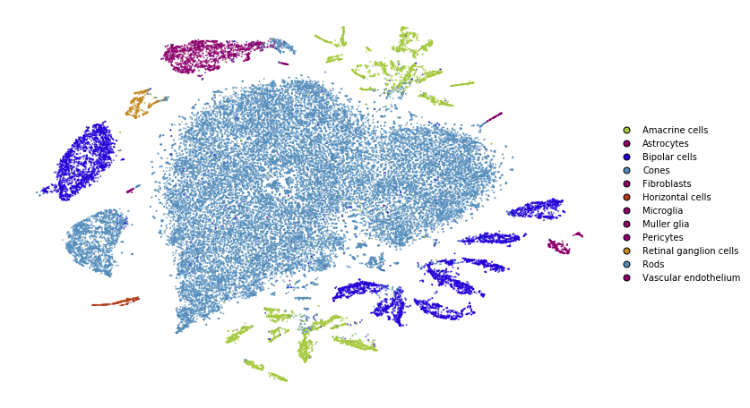
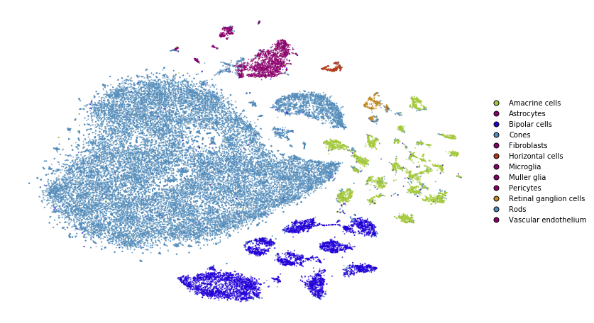
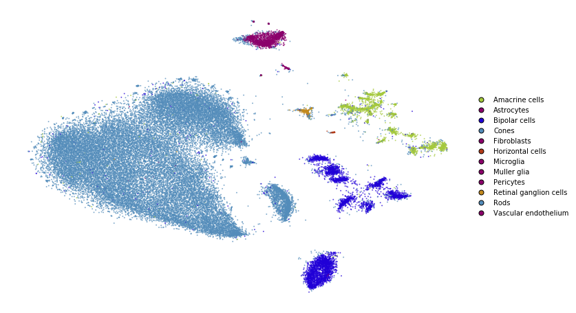
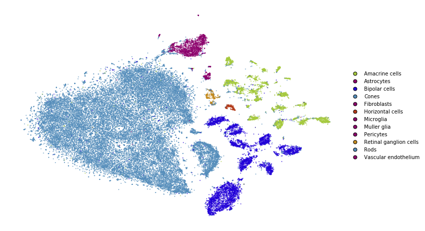

Preserving global structure
===========================

.. code:: python

    from openTSNE import TSNE, TSNEEmbedding, affinity, initialization
    from openTSNE import initialization
    from openTSNE.callbacks import ErrorLogger
    
    from examples import utils
    
    import numpy as np
    
    import matplotlib.pyplot as plt

Load data
---------

.. code:: python

    import gzip
    import pickle
    
    with gzip.open("data/macosko_2015.pkl.gz", "rb") as f:
        data = pickle.load(f)
    
    x = data["pca_50"]
    y = data["CellType1"].astype(str)

.. code:: python

    print("Data set contains %d samples with %d features" % x.shape)

.. code-block:: text

    Data set contains 44808 samples with 50 features

To avoid constantly specifying colors in our plots, define a helper
here.

.. code:: python

    def plot(x, **kwargs):
        utils.plot(x, y, colors=utils.MACOSKO_COLORS, **kwargs)

Easy improvements
-----------------

Standard t-SNE, as implemented in most software packages, can be
improved in several very easy ways that require virtually no effort in
openTSNE, but can drastically improve the quality of the embedding.

Standard t-SNE
~~~~~~~~~~~~~~

First, we’ll run t-SNE as it is implemented in most software packages.
This will serve as a baseline comparison.

.. code:: python

    tsne = TSNE(
        perplexity=30,
        initialization="random",
        metric="euclidean",
        n_jobs=8,
        random_state=3,
    )

.. code:: python

    %time embedding_standard = tsne.fit(x)

.. code-block:: text

    CPU times: user 7min 38s, sys: 20.3 s, total: 7min 58s
    Wall time: 1min 13s

.. code:: python

    plot(embedding_standard)

Using PCA initialization
~~~~~~~~~~~~~~~~~~~~~~~~

The first, easy improvement we can get is to “inject” some global
structure into the initialization. The initialization dictates which
regions points will appear in, so adding any global structure to the
initialization can help.

Note that this is the default in this implementation and the parameter
can be omitted.

.. code:: python

    tsne = TSNE(
        perplexity=30,
        initialization="pca",
        metric="euclidean",
        n_jobs=8,
        random_state=3,
    )

.. code:: python

    %time embedding_pca = tsne.fit(x)

.. code-block:: text

    CPU times: user 7min 7s, sys: 18.4 s, total: 7min 26s
    Wall time: 1min 7s

.. code:: python

    plot(embedding_pca)

.. image:: output_15_0.png

Using cosine distance
~~~~~~~~~~~~~~~~~~~~~

Typically, t-SNE is used to create an embedding of high dimensional data
sets. However, the notion of *Euclidean* distance breaks down in high
dimensions and the *cosine* distance is far more appropriate.

We can easily use the cosine distance by setting the ``metric``
parameter.

.. code:: python

    tsne = TSNE(
        perplexity=30,
        initialization="random",
        metric="cosine",
        n_jobs=8,
        random_state=3,
    )

.. code:: python

    %time embedding_cosine = tsne.fit(x)

.. code-block:: text

    CPU times: user 7min 13s, sys: 18.3 s, total: 7min 31s
    Wall time: 1min 10s

.. code:: python

    plot(embedding_cosine)

.. image:: output_19_0.png

Using PCA initialization and cosine distance
~~~~~~~~~~~~~~~~~~~~~~~~~~~~~~~~~~~~~~~~~~~~

Lastly, let’s see how our embedding looks with both the changes.

.. code:: python

    tsne = TSNE(
        perplexity=30,
        initialization="pca",
        metric="cosine",
        n_jobs=8,
        random_state=3,
    )

.. code:: python

    %time embedding_pca_cosine = tsne.fit(x)

.. code-block:: text

    CPU times: user 7min 5s, sys: 17.9 s, total: 7min 23s
    Wall time: 1min 8s

.. code:: python

    plot(embedding_pca_cosine)

.. image:: output_23_0.png

Summary
~~~~~~~

.. code:: python

    _, ax = plt.subplots(nrows=2, ncols=2, figsize=(12, 12))
    plot(embedding_standard, title="Standard t-SNE", ax=ax[0, 0], draw_legend=False)
    plot(embedding_pca, title="PCA initialization", ax=ax[0, 1], draw_legend=False)
    plot(embedding_cosine, title="Cosine distance", ax=ax[1, 0], draw_legend=False)
    plot(embedding_pca_cosine, title="PCA initialization + Cosine distance", ax=ax[1, 1], draw_legend=False)
    plt.tight_layout()

.. image:: output_25_0.png

We can see that we’ve made a lot of progress already. We would like
points of the same color to appear close to one another.

This is not the case in standard t-SNE and t-SNE with cosine distance,
because the green points appear on both the bottom and top of the
embedding and the dark blue points appear on both the left and right
sides.

This is improved when using PCA initialization and better still when we
use both PCA initialization and cosine distance.

Using perplexity
----------------

Perplexity can be thought of as the trade-off parameter between
preserving local and global structure. Lower values will emphasise local
structure, while larger values will do a better job at preserving global
structure.

Perplexity: 30
~~~~~~~~~~~~~~

.. code:: python

    plot(embedding_pca_cosine)

Perplexity: 500
~~~~~~~~~~~~~~~

.. code:: python

    tsne = TSNE(
        perplexity=500,
        initialization="pca",
        metric="cosine",
        n_jobs=8,
        random_state=3,
    )

.. code:: python

    %time embedding_pca_cosine_500 = tsne.fit(x)

.. code-block:: text

    CPU times: user 38min 2s, sys: 12.9 s, total: 38min 15s
    Wall time: 6min 8s

.. code:: python

    plot(embedding_pca_cosine_500)

.. image:: output_33_0.png

Using different affinity models
-------------------------------

We can take advantage of the observation above, and use combinations of
perplexities to obtain better embeddings.

In this section, we describe how to use the tricks described by Kobak
and Berens in “The art of using t-SNE for single-cell transcriptomics”.
While the publication focuses on t-SNE applications to single-cell data,
the methods shown here are applicable to any data set.

When dealing with large data sets, methods which compute large
perplexities may be very slow. Please see the ``large_data_sets``
notebook for an example of how to obtain a good embedding for large data
sets.

Perplexity annealing
~~~~~~~~~~~~~~~~~~~~

The first trick we can use is to first optimize the embedding using a
large perplexity to capture the global structure, then lower the
perplexity to something smaller to emphasize the local structure.

.. code:: python

    %%time
    affinities_annealing = affinity.PerplexityBasedNN(
        x,
        perplexity=500,
        metric="cosine",
        n_jobs=8,
        random_state=3,
    )

.. code-block:: text

    CPU times: user 10min 10s, sys: 3.46 s, total: 10min 13s
    Wall time: 2min 39s

.. code:: python

    %time init = initialization.pca(x, random_state=42)

.. code-block:: text

    CPU times: user 384 ms, sys: 12 ms, total: 396 ms
    Wall time: 65.3 ms

.. code:: python

    embedding = TSNEEmbedding(
        init,
        affinities_annealing,
        negative_gradient_method="fft",
        n_jobs=8,
    )

1. Perform normal t-SNE optimization with large perplexity

.. code:: python

    %time embedding1 = embedding.optimize(n_iter=250, exaggeration=12, momentum=0.5)

.. code-block:: text

    CPU times: user 6min 50s, sys: 1.45 s, total: 6min 52s
    Wall time: 51.6 s

.. code:: python

    plot(embedding1)

.. image:: output_41_0.png

.. code:: python

    %time embedding2 = embedding1.optimize(n_iter=750, exaggeration=1, momentum=0.8)

.. code-block:: text

    CPU times: user 21min 19s, sys: 8 s, total: 21min 27s
    Wall time: 2min 41s

.. code:: python

    plot(embedding2)

2. Lower perplexity and optimize

.. code:: python

    %time affinities_annealing.set_perplexity(50)

.. code-block:: text

    CPU times: user 10.8 s, sys: 204 ms, total: 11 s
    Wall time: 1.48 s

.. code:: python

    %time embedding3 = embedding2.optimize(n_iter=500, momentum=0.8)

.. code-block:: text

    CPU times: user 4min 42s, sys: 11.9 s, total: 4min 54s
    Wall time: 36.9 s

.. code:: python

    plot(embedding3)

.. code:: python

    embedding_annealing = embedding3.view(np.ndarray)

Multiscale
~~~~~~~~~~

One problem when using a high perplexity value e.g. 500 is that some of
the clusters start to mix with each other, making the separation less
apparent. Instead of a typical Gaussian kernel, we can use a multiscale
kernel which will account for two different perplexity values. This
typically results in better separation of clusters while still keeping
much of the global structure.

.. code:: python

    %%time
    affinities_multiscale_mixture = affinity.Multiscale(
        x,
        perplexities=[50, 500],
        metric="cosine",
        n_jobs=8,
        random_state=3,
    )

.. code-block:: text

    CPU times: user 11min 40s, sys: 5.19 s, total: 11min 45s
    Wall time: 2min 54s

.. code:: python

    %time init = initialization.pca(x, random_state=42)

.. code-block:: text

    CPU times: user 440 ms, sys: 8 ms, total: 448 ms
    Wall time: 74.2 ms

.. code:: python

    embedding = TSNEEmbedding(
        init,
        affinities_multiscale_mixture,
        negative_gradient_method="fft",
        n_jobs=8,
    )

Now, we just optimize just like we would standard t-SNE.

.. code:: python

    %time embedding1 = embedding.optimize(n_iter=250, exaggeration=12, momentum=0.5)

.. code-block:: text

    CPU times: user 6min 31s, sys: 1.37 s, total: 6min 32s
    Wall time: 49.1 s

.. code:: python

    plot(embedding1)

.. image:: output_55_0.png

.. code:: python

    %time embedding2 = embedding1.optimize(n_iter=750, exaggeration=1, momentum=0.8)

.. code-block:: text

    CPU times: user 21min 41s, sys: 10.7 s, total: 21min 52s
    Wall time: 2min 44s

.. code:: python

    plot(embedding2)

.. image:: output_57_0.png

.. code:: python

    embedding_multiscale = embedding2.view(np.ndarray)

Summary
~~~~~~~

.. code:: python

    _, ax = plt.subplots(nrows=2, ncols=2, figsize=(12, 12))
    plot(embedding_pca_cosine, title="Perplexity 30", ax=ax[0, 0], draw_legend=False)
    plot(embedding_pca_cosine_500, title="Perplexity 500", ax=ax[0, 1], draw_legend=False)
    plot(embedding_annealing, title="Perplexity annealing: 50, 500", ax=ax[1, 0], draw_legend=False)
    plot(embedding_multiscale, title="Multiscale: 50, 500", ax=ax[1, 1], draw_legend=False)
    plt.tight_layout()

.. image:: output_60_0.png

Comparison to UMAP
------------------

.. code:: python

    from umap import UMAP
    from itertools import product

.. code:: python

    %%time
    embeddings = []
    
    for n_neighbors, min_dist in product([15, 200], [0.1, 0.5]):
        umap = UMAP(n_neighbors=n_neighbors, min_dist=min_dist, metric="cosine", random_state=3)
        embedding_umap = umap.fit_transform(x)
        embeddings.append((n_neighbors, min_dist, embedding_umap))

.. code-block:: text

    CPU times: user 11min 18s, sys: 48 s, total: 12min 6s
    Wall time: 8min 3s

.. code:: python

    _, ax = plt.subplots(nrows=2, ncols=2, figsize=(12, 12))
    plot(embeddings[0][2], title=f"k={embeddings[0][0]}, min_dist={embeddings[0][1]}", ax=ax[0, 0], draw_legend=False)
    plot(embeddings[1][2], title=f"k={embeddings[1][0]}, min_dist={embeddings[1][1]}", ax=ax[0, 1], draw_legend=False)
    plot(embeddings[2][2], title=f"k={embeddings[2][0]}, min_dist={embeddings[2][1]}", ax=ax[1, 0], draw_legend=False)
    plot(embeddings[3][2], title=f"k={embeddings[3][0]}, min_dist={embeddings[3][1]}", ax=ax[1, 1], draw_legend=False)
    plt.tight_layout()

.. image:: output_64_0.png

