Preserving global structure
===========================

.. code:: ipython3

    import gzip
    import pickle
    
    import numpy as np
    import openTSNE
    from examples import utils
    
    import matplotlib.pyplot as plt

Load data
---------

The preprocessed data set can be downloaded from
http://file.biolab.si/opentsne/benchmark/macosko_2015.pkl.gz.

.. code:: ipython3

    %%time
    with gzip.open("data/macosko_2015.pkl.gz", "rb") as f:
        data = pickle.load(f)
    
    x = data["pca_50"]
    y = data["CellType1"].astype(str)

.. parsed-literal::

    CPU times: user 159 ms, sys: 43.7 ms, total: 203 ms
    Wall time: 203 ms

.. code:: ipython3

    print("Data set contains %d samples with %d features" % x.shape)

.. parsed-literal::

    Data set contains 44808 samples with 50 features

To avoid constantly specifying colors in our plots, define a helper
here.

.. code:: ipython3

    def plot(x, **kwargs):
        utils.plot(x, y, colors=utils.MACOSKO_COLORS, **kwargs)

Easy improvements
-----------------

Standard t-SNE, as implemented in most software packages, can be
improved in several very easy ways that require virtually no effort in
openTSNE, but can drastically improve the quality of the embedding.

Standard t-SNE
~~~~~~~~~~~~~~

First, we’ll run t-SNE as it is implemented in most software packages.
This will serve as a baseline comparison.

.. code:: ipython3

    %%time
    embedding_standard = openTSNE.TSNE(
        perplexity=30,
        initialization="random",
        metric="euclidean",
        n_jobs=8,
        random_state=3,
    ).fit(x)

.. parsed-literal::

    CPU times: user 3min 44s, sys: 2.81 s, total: 3min 47s
    Wall time: 2min 7s

.. code:: ipython3

    plot(embedding_standard)

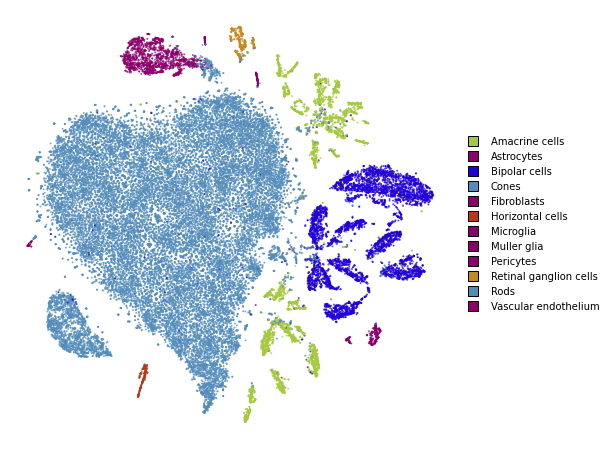

Using PCA initialization
~~~~~~~~~~~~~~~~~~~~~~~~

The first, easy improvement we can get is to “inject” some global
structure into the initialization. The intialization dictates which
regions points will appear in, so adding any global structure to the
initilization can help.

Note that this is the default in this implementation and the parameter
can be omitted.

.. code:: ipython3

    %%time
    embedding_pca = openTSNE.TSNE(
        perplexity=30,
        initialization="pca",
        metric="euclidean",
        n_jobs=8,
        random_state=3,
    ).fit(x)

.. parsed-literal::

    CPU times: user 3min 37s, sys: 3.52 s, total: 3min 40s
    Wall time: 2min 1s

.. code:: ipython3

    plot(embedding_pca)

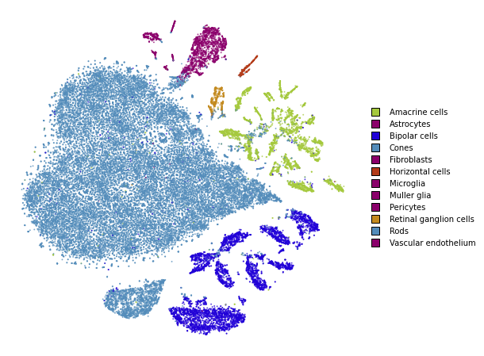

Using cosine distance
~~~~~~~~~~~~~~~~~~~~~

Typically, t-SNE is used to create an embedding of high dimensional data
sets. However, the notion of *Euclidean* distance breaks down in high
dimensions and the *cosine* distance is far more appropriate.

We can easily use the cosine distance by setting the ``metric``
parameter.

.. code:: ipython3

    %%time
    embedding_cosine = openTSNE.TSNE(
        perplexity=30,
        initialization="random",
        metric="cosine",
        n_jobs=8,
        random_state=3,
    ).fit(x)

.. parsed-literal::

    CPU times: user 3min 34s, sys: 2.54 s, total: 3min 37s
    Wall time: 1min 51s

.. code:: ipython3

    plot(embedding_cosine)

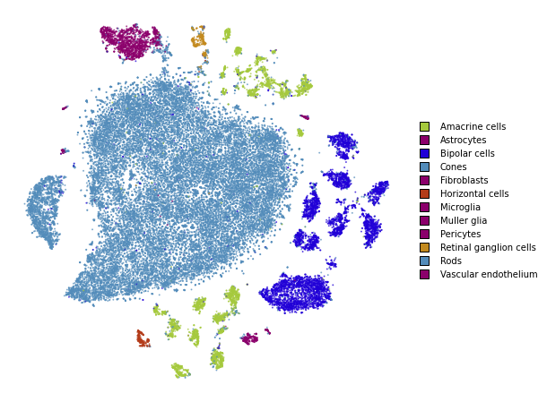

Using PCA initialization and cosine distance
~~~~~~~~~~~~~~~~~~~~~~~~~~~~~~~~~~~~~~~~~~~~

Lastly, let’s see how our embedding looks with both the changes.

.. code:: ipython3

    %%time
    embedding_pca_cosine = openTSNE.TSNE(
        perplexity=30,
        initialization="pca",
        metric="cosine",
        n_jobs=8,
        random_state=3,
    ).fit(x)

.. parsed-literal::

    CPU times: user 3min 42s, sys: 3.38 s, total: 3min 45s
    Wall time: 2min

.. code:: ipython3

    plot(embedding_pca_cosine)

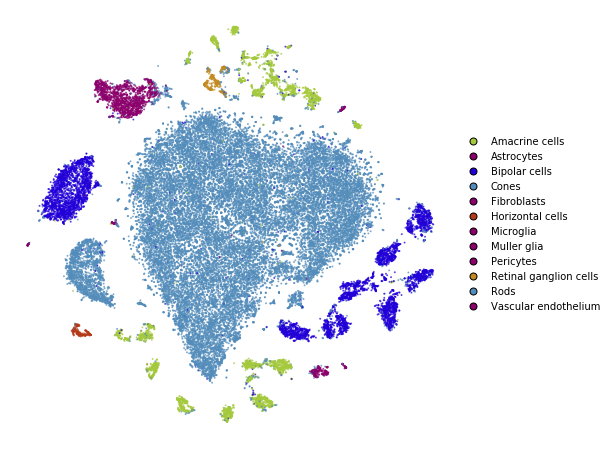

Summary
~~~~~~~

.. code:: ipython3

    fig, ax = plt.subplots(nrows=2, ncols=2, figsize=(12, 12))
    plot(embedding_standard, title="Standard t-SNE", ax=ax[0, 0], draw_legend=False)
    plot(embedding_pca, title="PCA initialization", ax=ax[0, 1], draw_legend=False)
    plot(embedding_cosine, title="Cosine distance", ax=ax[1, 0], draw_legend=False)
    plot(embedding_pca_cosine, title="PCA initialization + Cosine distance", ax=ax[1, 1], draw_legend=False)
    plt.tight_layout()

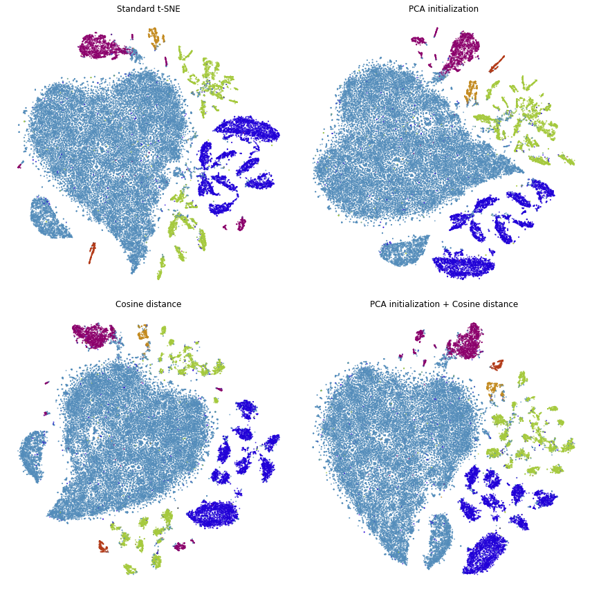

We can see that we’ve made a lot of progress already. We would like
points of the same color to appear close to one another.

This is not the case in standard t-SNE and t-SNE with cosine distance,
because the green points appear on both the bottom and top of the
embedding and the dark blue points appear on both the left and right
sides.

This is improved when using PCA initialization and better still when we
use both PCA initialization and cosine distance.

Using perplexity
----------------

Perplexity can be thought of as the trade-off parameter between
preserving local and global structure. Lower values will emphasise local
structure, while larger values will do a better job at preserving global
structure.

Perplexity: 30
~~~~~~~~~~~~~~

.. code:: ipython3

    plot(embedding_pca_cosine)

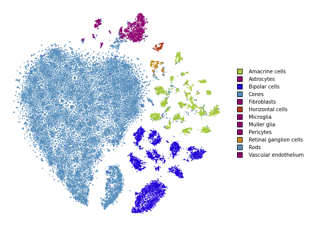

Perplexity: 500
~~~~~~~~~~~~~~~

.. code:: ipython3

    %%time
    embedding_pca_cosine_500 = openTSNE.TSNE(
        perplexity=500,
        initialization="pca",
        metric="cosine",
        n_jobs=8,
        random_state=3,
    ).fit(x)

.. parsed-literal::

    CPU times: user 23min 9s, sys: 7.15 s, total: 23min 17s
    Wall time: 4min 58s

.. code:: ipython3

    plot(embedding_pca_cosine_500)

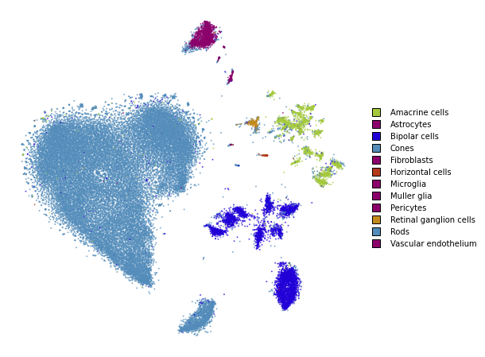

Using different affinity models
-------------------------------

We can take advantage of the observation above, and use combinations of
perplexities to obtain better embeddings.

In this section, we describe how to use the tricks described by Kobak
and Berens in “The art of using t-SNE for single-cell transcriptomics”.
While the publication focuses on t-SNE applications to single-cell data,
the methods shown here are applicable to any data set.

When dealing with large data sets, methods which compute large
perplexities may be very slow. Please see the ``large_data_sets``
notebook for an example of how to obtain a good embedding for large data
sets.

Perplexity annealing
~~~~~~~~~~~~~~~~~~~~

The first trick we can use is to first optimize the embedding using a
large perplexity to capture the global structure, then lower the
perplexity to something smaller to emphasize the local structure.

.. code:: ipython3

    %%time
    embedding_annealing = openTSNE.TSNE(
        perplexity=500, metric="cosine", initialization="pca", n_jobs=8, random_state=3
    ).fit(x)

.. parsed-literal::

    CPU times: user 23min 28s, sys: 6.7 s, total: 23min 35s
    Wall time: 5min 1s

.. code:: ipython3

    %time embedding_annealing.affinities.set_perplexities([50])

.. parsed-literal::

    CPU times: user 3.35 s, sys: 233 ms, total: 3.59 s
    Wall time: 1.33 s

.. code:: ipython3

    %time embedding_annealing = embedding_annealing.optimize(250)

.. parsed-literal::

    CPU times: user 1min 26s, sys: 218 ms, total: 1min 26s
    Wall time: 46.5 s

.. code:: ipython3

    plot(embedding_annealing)

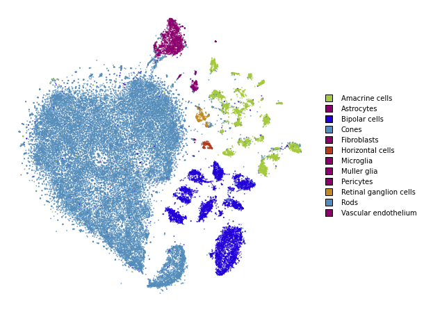

Multiscale
~~~~~~~~~~

One problem when using a high perplexity value e.g. 500 is that some of
the clusters start to mix with each other, making the separation less
apparent. Instead of a typical Gaussian kernel, we can use a multiscale
kernel which will account for two different perplexity values. This
typically results in better separation of clusters while still keeping
much of the global structure.

.. code:: ipython3

    %%time
    affinities_multiscale_mixture = openTSNE.affinity.Multiscale(
        x,
        perplexities=[50, 500],
        metric="cosine",
        n_jobs=8,
        random_state=3,
    )

.. parsed-literal::

    CPU times: user 6min 15s, sys: 8.2 s, total: 6min 23s
    Wall time: 1min 23s

.. code:: ipython3

    %time init = openTSNE.initialization.pca(x, random_state=42)

.. parsed-literal::

    CPU times: user 1.12 s, sys: 872 ms, total: 1.99 s
    Wall time: 349 ms

Now, we just optimize just like we would standard t-SNE.

.. code:: ipython3

    embedding_multiscale = openTSNE.TSNE(n_jobs=8).fit(
        affinities=affinities_multiscale_mixture,
        initialization=init,
    )

.. code:: ipython3

    plot(embedding_multiscale)

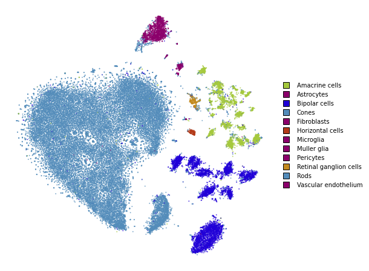

Summary
~~~~~~~

.. code:: ipython3

    fig, ax = plt.subplots(nrows=2, ncols=2, figsize=(12, 12))
    plot(embedding_pca_cosine, title="Perplexity 30", ax=ax[0, 0], draw_legend=False)
    plot(embedding_pca_cosine_500, title="Perplexity 500", ax=ax[0, 1], draw_legend=False)
    plot(embedding_annealing, title="Perplexity annealing: 50, 500", ax=ax[1, 0], draw_legend=False)
    plot(embedding_multiscale, title="Multiscale: 50, 500", ax=ax[1, 1], draw_legend=False)
    plt.tight_layout()

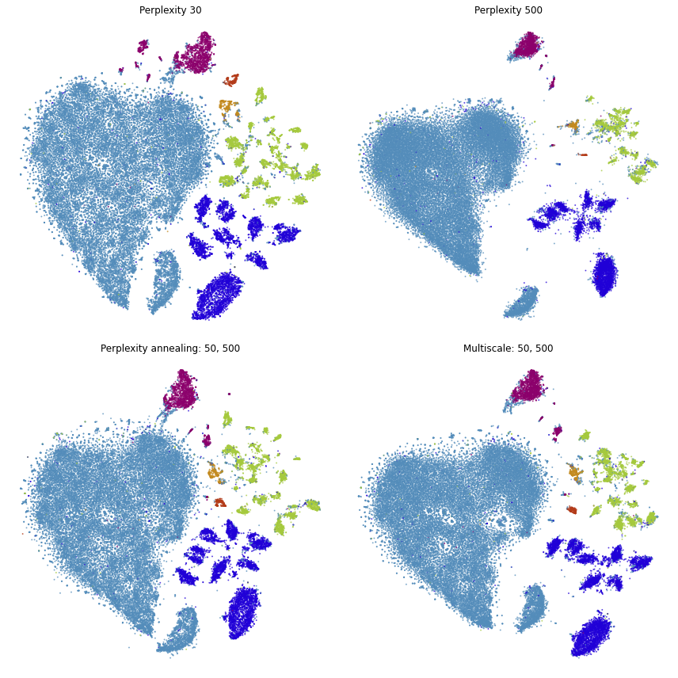

Comparison to UMAP
------------------

.. code:: ipython3

    from umap import UMAP
    from itertools import product

.. parsed-literal::

    /home/ppolicar/local/miniconda3/envs/tsne-paper/lib/python3.9/site-packages/tqdm/auto.py:22: TqdmWarning: IProgress not found. Please update jupyter and ipywidgets. See https://ipywidgets.readthedocs.io/en/stable/user_install.html
      from .autonotebook import tqdm as notebook_tqdm

.. code:: ipython3

    %%time
    embeddings = []
    
    for n_neighbors, init in product([15, 200], ["random", "spectral"]):
        umap = UMAP(n_neighbors=n_neighbors, init=init, metric="cosine", random_state=3)
        embedding_umap = umap.fit_transform(x)
        embeddings.append((n_neighbors, init, embedding_umap))

.. parsed-literal::

    CPU times: user 12min 5s, sys: 53.6 s, total: 12min 58s
    Wall time: 6min 34s

.. code:: ipython3

    fig, ax = plt.subplots(nrows=2, ncols=2, figsize=(12, 12))
    plot(embeddings[0][2], title=f"k={embeddings[0][0]}, init={embeddings[0][1]}", ax=ax[0, 0], draw_legend=False)
    plot(embeddings[1][2], title=f"k={embeddings[1][0]}, init={embeddings[1][1]}", ax=ax[0, 1], draw_legend=False)
    plot(embeddings[2][2], title=f"k={embeddings[2][0]}, init={embeddings[2][1]}", ax=ax[1, 0], draw_legend=False)
    plot(embeddings[3][2], title=f"k={embeddings[3][0]}, init={embeddings[3][1]}", ax=ax[1, 1], draw_legend=False)
    plt.tight_layout()

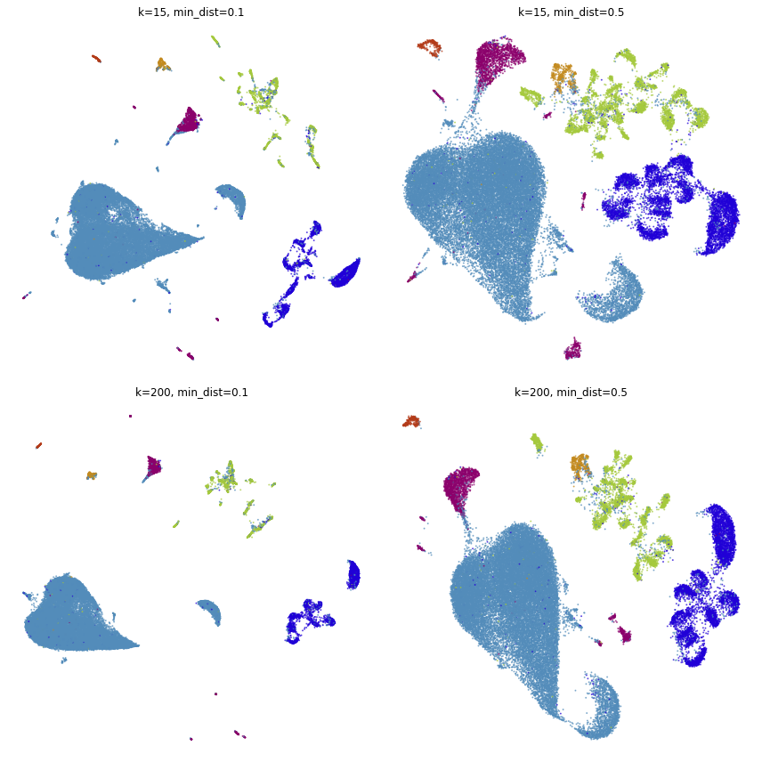

