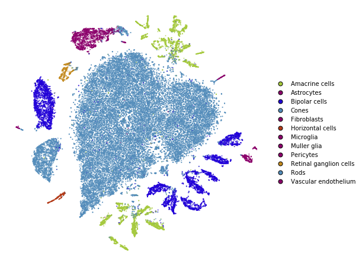
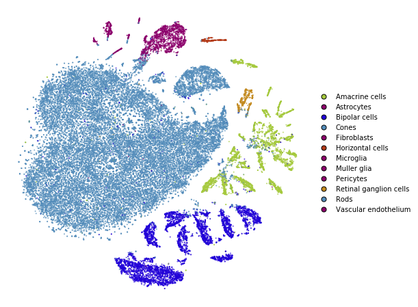
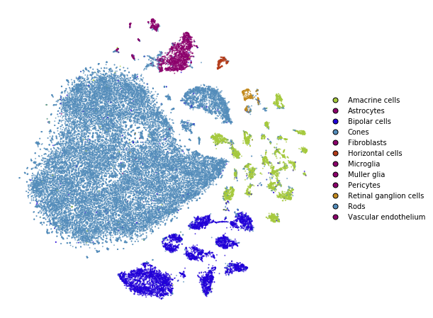
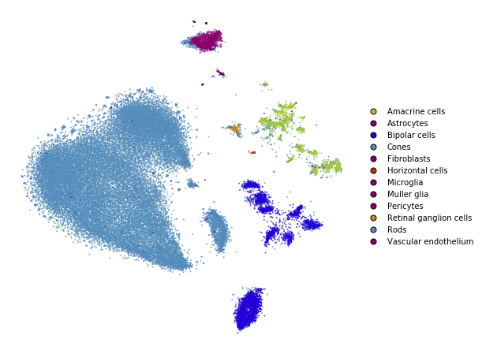
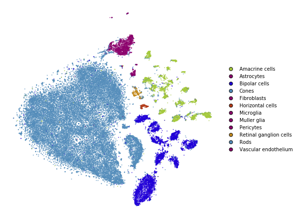
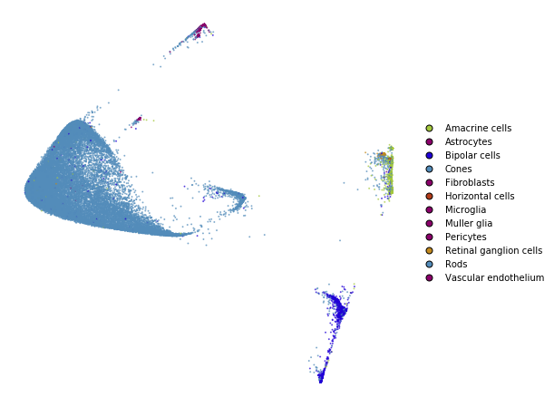
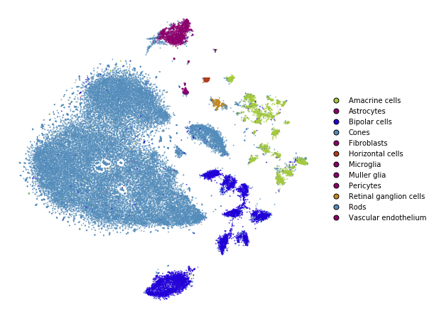
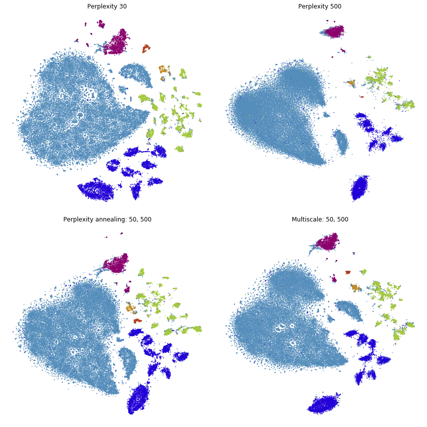
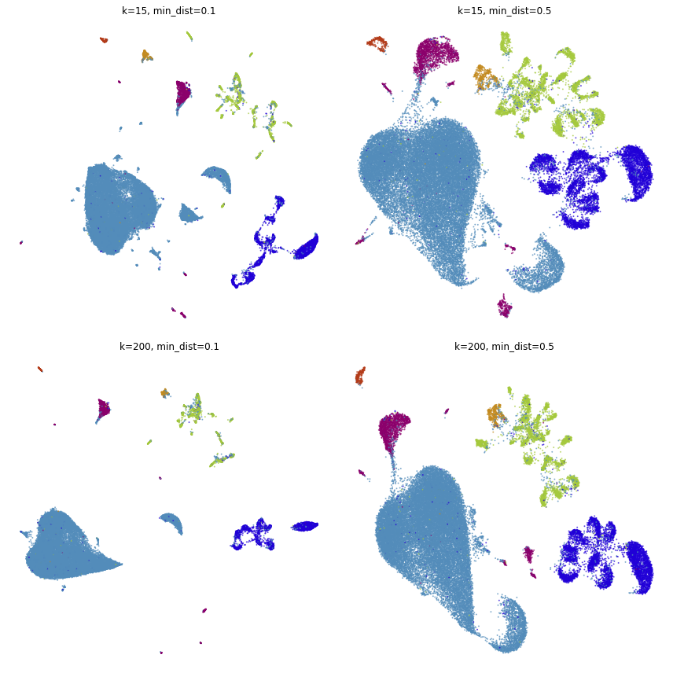

Preserving global structure
===========================

.. code:: ipython3

    from openTSNE import TSNE, TSNEEmbedding, affinity, initialization
    from openTSNE import initialization
    from openTSNE.callbacks import ErrorLogger
    
    from examples import utils
    
    import numpy as np
    
    import matplotlib.pyplot as plt

Load data
---------

.. code:: ipython3

    import gzip
    import pickle
    
    with gzip.open("data/macosko_2015.pkl.gz", "rb") as f:
        data = pickle.load(f)
    
    x = data["pca_50"]
    y = data["CellType1"].astype(str)

.. code:: ipython3

    print("Data set contains %d samples with %d features" % x.shape)

.. parsed-literal::

    Data set contains 44808 samples with 50 features

To avoid constantly specifying colors in our plots, define a helper
here.

.. code:: ipython3

    def plot(x, **kwargs):
        utils.plot(x, y, colors=utils.MACOSKO_COLORS, **kwargs)

Easy improvements
-----------------

Standard t-SNE, as implemented in most software packages, can be
improved in several very easy ways that require virtually no effort in
openTSNE, but can drastically improve the quality of the embedding.

Standard t-SNE
~~~~~~~~~~~~~~

First, we’ll run t-SNE as it is implemented in most software packages.
This will serve as a baseline comparison.

.. code:: ipython3

    tsne = TSNE(
        perplexity=30,
        initialization="random",
        metric="euclidean",
        n_jobs=8,
        random_state=3,
    )

.. code:: ipython3

    %time embedding_standard = tsne.fit(x)

.. parsed-literal::

    CPU times: user 45min 48s, sys: 54.1 s, total: 46min 42s
    Wall time: 1min 37s

.. code:: ipython3

    plot(embedding_standard)

Using PCA initialization
~~~~~~~~~~~~~~~~~~~~~~~~

The first, easy improvement we can get is to “inject” some global
structure into the initialization. The intialization dictates which
regions points will appear in, so adding any global structure to the
initilization can help.

Note that this is the default in this implementation and the parameter
can be omitted.

.. code:: ipython3

    tsne = TSNE(
        perplexity=30,
        initialization="pca",
        metric="euclidean",
        n_jobs=8,
        random_state=3,
    )

.. code:: ipython3

    %time embedding_pca = tsne.fit(x)

.. parsed-literal::

    CPU times: user 42min 9s, sys: 49.8 s, total: 42min 59s
    Wall time: 1min 28s

.. code:: ipython3

    plot(embedding_pca)

Using cosine distance
~~~~~~~~~~~~~~~~~~~~~

Typically, t-SNE is used to create an embedding of high dimensional data
sets. However, the notion of *Euclidean* distance breaks down in high
dimensions and the *cosine* distance is far more appropriate.

We can easily use the cosine distance by setting the ``metric``
parameter.

.. code:: ipython3

    tsne = TSNE(
        perplexity=30,
        initialization="random",
        metric="cosine",
        n_jobs=8,
        random_state=3,
    )

.. code:: ipython3

    %time embedding_cosine = tsne.fit(x)

.. parsed-literal::

    CPU times: user 46min 27s, sys: 55.8 s, total: 47min 23s
    Wall time: 1min 37s

.. code:: ipython3

    plot(embedding_cosine)

.. image:: output_19_0.png

Using PCA initialization and cosine distance
~~~~~~~~~~~~~~~~~~~~~~~~~~~~~~~~~~~~~~~~~~~~

Lastly, let’s see how our embedding looks with both the changes.

.. code:: ipython3

    tsne = TSNE(
        perplexity=30,
        initialization="pca",
        metric="cosine",
        n_jobs=8,
        random_state=3,
    )

.. code:: ipython3

    %time embedding_pca_cosine = tsne.fit(x)

.. parsed-literal::

    CPU times: user 44min 15s, sys: 52.6 s, total: 45min 7s
    Wall time: 1min 32s

.. code:: ipython3

    plot(embedding_pca_cosine)

Summary
~~~~~~~

.. code:: ipython3

    _, ax = plt.subplots(nrows=2, ncols=2, figsize=(12, 12))
    plot(embedding_standard, title="Standard t-SNE", ax=ax[0, 0], draw_legend=False)
    plot(embedding_pca, title="PCA initialization", ax=ax[0, 1], draw_legend=False)
    plot(embedding_cosine, title="Cosine distance", ax=ax[1, 0], draw_legend=False)
    plot(embedding_pca_cosine, title="PCA initialization + Cosine distance", ax=ax[1, 1], draw_legend=False)
    plt.tight_layout()

.. image:: output_25_0.png

We can see that we’ve made a lot of progress already. We would like
points of the same color to appear close to one another.

This is not the case in standard t-SNE and t-SNE with cosine distance,
because the green points appear on both the bottom and top of the
embedding and the dark blue points appear on both the left and right
sides.

This is improved when using PCA initialization and better still when we
use both PCA initialization and cosine distance.

Using perplexity
----------------

Perplexity can be thought of as the trade-off parameter between
preserving local and global structure. Lower values will emphasise local
structure, while larger values will do a better job at preserving global
structure.

Perplexity: 30
~~~~~~~~~~~~~~

.. code:: ipython3

    plot(embedding_pca_cosine)

.. image:: output_29_0.png

Perplexity: 500
~~~~~~~~~~~~~~~

.. code:: ipython3

    tsne = TSNE(
        perplexity=500,
        initialization="pca",
        metric="cosine",
        n_jobs=8,
        random_state=3,
    )

.. code:: ipython3

    %time embedding_pca_cosine_500 = tsne.fit(x)

.. parsed-literal::

    CPU times: user 2h 27min 38s, sys: 2min 32s, total: 2h 30min 10s
    Wall time: 7min 15s

.. code:: ipython3

    plot(embedding_pca_cosine_500)

Using different affinity models
-------------------------------

We can take advantage of the observation above, and use combinations of
perplexities to obtain better embeddings.

In this section, we describe how to use the tricks described by Kobak
and Berens in “The art of using t-SNE for single-cell transcriptomics”.
While the publication focuses on t-SNE applications to single-cell data,
the methods shown here are applicable to any data set.

When dealing with large data sets, methods which compute large
perplexities may be very slow. Please see the ``large_data_sets``
notebook for an example of how to obtain a good embedding for large data
sets.

Perplexity annealing
~~~~~~~~~~~~~~~~~~~~

The first trick we can use is to first optimize the embedding using a
large perplexity to capture the global structure, then lower the
perplexity to something smaller to emphasize the local structure.

.. code:: ipython3

    %%time
    affinities_annealing = affinity.PerplexityBasedNN(
        x,
        perplexity=500,
        metric="cosine",
        n_jobs=8,
        random_state=3,
    )

.. parsed-literal::

    CPU times: user 19min 3s, sys: 16.1 s, total: 19min 19s
    Wall time: 3min 51s

.. code:: ipython3

    %time init = initialization.pca(x, random_state=42)

.. parsed-literal::

    CPU times: user 3.77 s, sys: 232 ms, total: 4 s
    Wall time: 100 ms

.. code:: ipython3

    embedding = TSNEEmbedding(
        init,
        affinities_annealing,
        negative_gradient_method="fft",
        n_jobs=8,
    )

1. Perform normal t-SNE optimization with large perplexity

.. code:: ipython3

    %time embedding1 = embedding.optimize(n_iter=250, exaggeration=12, momentum=0.5)

.. parsed-literal::

    CPU times: user 30min 56s, sys: 35 s, total: 31min 31s
    Wall time: 48.2 s

.. code:: ipython3

    plot(embedding1)

.. image:: output_41_0.png

.. code:: ipython3

    %time embedding2 = embedding1.optimize(n_iter=750, exaggeration=1, momentum=0.8)

.. parsed-literal::

    CPU times: user 1h 36min 47s, sys: 1min 41s, total: 1h 38min 29s
    Wall time: 2min 33s

.. code:: ipython3

    plot(embedding2)

2. Lower perplexity and optimize

.. code:: ipython3

    %time affinities_annealing.set_perplexity(50)

.. parsed-literal::

    CPU times: user 19.3 s, sys: 1.26 s, total: 20.6 s
    Wall time: 1.54 s

.. code:: ipython3

    %time embedding3 = embedding2.optimize(n_iter=500, momentum=0.8)

.. parsed-literal::

    CPU times: user 31min 55s, sys: 39 s, total: 32min 34s
    Wall time: 49.7 s

.. code:: ipython3

    plot(embedding3)

.. code:: ipython3

    embedding_annealing = embedding3.view(np.ndarray)

Multiscale
~~~~~~~~~~

One problem when using a high perplexity value e.g. 500 is that some of
the clusters start to mix with each other, making the separation less
apparent. Instead of a typical Gaussian kernel, we can use a multiscale
kernel which will account for two different perplexity values. This
typically results in better separation of clusters while still keeping
much of the global structure.

.. code:: ipython3

    %%time
    affinities_multiscale_mixture = affinity.Multiscale(
        x,
        perplexities=[50, 500],
        metric="cosine",
        n_jobs=8,
        random_state=3,
    )

.. parsed-literal::

    CPU times: user 21min 11s, sys: 38.3 s, total: 21min 50s
    Wall time: 4min 13s

.. code:: ipython3

    %time init = initialization.pca(x, random_state=42)

.. parsed-literal::

    CPU times: user 9.72 s, sys: 455 ms, total: 10.2 s
    Wall time: 255 ms

.. code:: ipython3

    embedding = TSNEEmbedding(
        init,
        affinities_multiscale_mixture,
        negative_gradient_method="fft",
        n_jobs=8,
    )

Now, we just optimize just like we would standard t-SNE.

.. code:: ipython3

    %time embedding1 = embedding.optimize(n_iter=250, exaggeration=12, momentum=0.5)

.. parsed-literal::

    CPU times: user 31min 24s, sys: 32.7 s, total: 31min 56s
    Wall time: 48.6 s

.. code:: ipython3

    plot(embedding1)

.. code:: ipython3

    %time embedding2 = embedding1.optimize(n_iter=750, exaggeration=1, momentum=0.8)

.. parsed-literal::

    CPU times: user 1h 36min 12s, sys: 1min 38s, total: 1h 37min 51s
    Wall time: 2min 38s

.. code:: ipython3

    plot(embedding2)

.. code:: ipython3

    embedding_multiscale = embedding2.view(np.ndarray)

Summary
~~~~~~~

.. code:: ipython3

    _, ax = plt.subplots(nrows=2, ncols=2, figsize=(12, 12))
    plot(embedding_pca_cosine, title="Perplexity 30", ax=ax[0, 0], draw_legend=False)
    plot(embedding_pca_cosine_500, title="Perplexity 500", ax=ax[0, 1], draw_legend=False)
    plot(embedding_annealing, title="Perplexity annealing: 50, 500", ax=ax[1, 0], draw_legend=False)
    plot(embedding_multiscale, title="Multiscale: 50, 500", ax=ax[1, 1], draw_legend=False)
    plt.tight_layout()

Comparison to UMAP
------------------

.. code:: ipython3

    from umap import UMAP
    from itertools import product

.. parsed-literal::

    /home/ppolicar/local/miniconda3/envs/tsne/lib/python3.7/site-packages/scikit_learn-0.21.0-py3.7-linux-x86_64.egg/sklearn/externals/joblib/__init__.py:15: DeprecationWarning: sklearn.externals.joblib is deprecated in 0.21 and will be removed in 0.23. Please import this functionality directly from joblib, which can be installed with: pip install joblib. If this warning is raised when loading pickled models, you may need to re-serialize those models with scikit-learn 0.21+.
      warnings.warn(msg, category=DeprecationWarning)

.. code:: ipython3

    %%time
    embeddings = []
    
    for n_neighbors, min_dist in product([15, 200], [0.1, 0.5]):
        umap = UMAP(n_neighbors=n_neighbors, min_dist=min_dist, metric="cosine", random_state=3)
        embedding_umap = umap.fit_transform(x)
        embeddings.append((n_neighbors, min_dist, embedding_umap))

.. parsed-literal::

    CPU times: user 1h 11min 8s, sys: 4min 30s, total: 1h 15min 38s
    Wall time: 12min 25s

.. code:: ipython3

    _, ax = plt.subplots(nrows=2, ncols=2, figsize=(12, 12))
    plot(embeddings[0][2], title=f"k={embeddings[0][0]}, min_dist={embeddings[0][1]}", ax=ax[0, 0], draw_legend=False)
    plot(embeddings[1][2], title=f"k={embeddings[1][0]}, min_dist={embeddings[1][1]}", ax=ax[0, 1], draw_legend=False)
    plot(embeddings[2][2], title=f"k={embeddings[2][0]}, min_dist={embeddings[2][1]}", ax=ax[1, 0], draw_legend=False)
    plot(embeddings[3][2], title=f"k={embeddings[3][0]}, min_dist={embeddings[3][1]}", ax=ax[1, 1], draw_legend=False)
    plt.tight_layout()

