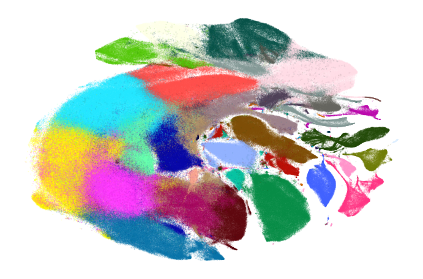
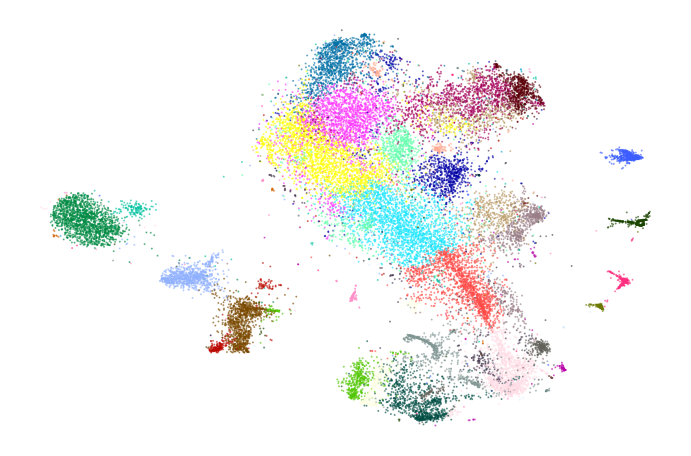
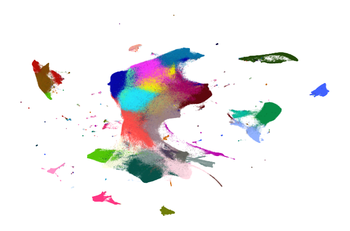

Embedding large data sets
=========================

Embedding large data sets typically requires more care. Using various
tricks described in *preserving_global_structure* can become quite slow
to run. Instead, we can take a smaller, manageable sample of our data
set, obtain a good visualization of that. Then, we can add the remaining
points to the embedding and use that as our initialization.

Remember that the initialization largely affects the structure of the
embedding. This way, our initialization provides the global structure
for the embedding, and the subsequent optimization can focus on
preserving local structure.

.. code:: python

    from openTSNE import TSNE, TSNEEmbedding, affinity, initialization
    from openTSNE import initialization
    from openTSNE.callbacks import ErrorLogger
    
    from examples import utils
    
    import numpy as np
    
    import matplotlib.pyplot as plt

Load data
---------

.. code:: python

    import gzip
    import pickle
    
    with gzip.open("data/10x_mouse_zheng.pkl.gz", "rb") as f:
        data = pickle.load(f)
    
    x = data["pca_50"]
    y = data["CellType1"]

.. code:: python

    print("Data set contains %d samples with %d features" % x.shape)

.. code-block:: text

    Data set contains 1306127 samples with 50 features

.. code:: python

    def plot(x, y, **kwargs):
        utils.plot(
            x,
            y,
            colors=utils.MOUSE_10X_COLORS,
            alpha=kwargs.pop("alpha", 0.1),
            draw_legend=False,
            **kwargs,
        )

.. code:: python

    def rotate(degrees):
        phi = degrees * np.pi / 180
        return np.array([
            [np.cos(phi), -np.sin(phi)],
            [np.sin(phi), np.cos(phi)],
        ])

.. code:: python

    plot(x, y)

.. image:: output_7_0.png

We’ll also precompute the full affinities, since we’ll be needing it in
several places throughout the notebook, and can take a long time to run.

.. code:: python

    %%time
    affinities = affinity.PerplexityBasedNN(
        x,
        perplexity=30,
        n_jobs=8,
        random_state=0,
    )

.. code-block:: text

    CPU times: user 38min 48s, sys: 13.6 s, total: 39min 1s
    Wall time: 25min 3s

Standard t-SNE
--------------

First, let’s see what standard t-SNE does.

.. code:: python

    %time init = initialization.pca(x, random_state=0)

.. code-block:: text

    CPU times: user 17.6 s, sys: 1.36 s, total: 19 s
    Wall time: 3.19 s

.. code:: python

    embedding_standard = TSNEEmbedding(
        init,
        affinities,
        negative_gradient_method="fft",
        n_jobs=8,
    )

.. code:: python

    %%time
    embedding_standard.optimize(n_iter=250, exaggeration=12, momentum=0.5, inplace=True)
    embedding_standard.optimize(n_iter=750, exaggeration=1, momentum=0.8, inplace=True)

.. code-block:: text

    CPU times: user 2h 23min 6s, sys: 2min 8s, total: 2h 25min 15s
    Wall time: 18min 46s

.. code:: python

    plot(embedding_standard, y)

This doesn’t look too great. The cluster separation is quite poor and
the visualization is visually not very appealing.

Using exaggeration
------------------

Exaggeration can be used in order to get better separation between
clusters. Let’s see if that helps.

.. code:: python

    %time init = initialization.pca(x, random_state=0)

.. code-block:: text

    CPU times: user 17.1 s, sys: 1.22 s, total: 18.3 s
    Wall time: 3.07 s

.. code:: python

    embedding_exag = TSNEEmbedding(
        init,
        affinities,
        negative_gradient_method="fft",
        n_jobs=8,
    )

.. code:: python

    %%time
    embedding_exag.optimize(n_iter=250, exaggeration=12, momentum=0.5, inplace=True)
    embedding_exag.optimize(n_iter=750, exaggeration=4, momentum=0.8, inplace=True)

.. code-block:: text

    CPU times: user 2h 24min 55s, sys: 12min, total: 2h 36min 55s
    Wall time: 27min 22s

.. code:: python

    plot(embedding_exag, y)

.. image:: output_20_0.png

The separation has improved quite a bit, but many clusters are still
intertwined with others.

With downsampling
-----------------

We now perform the sample-transform trick we described above.

Create train/test split
~~~~~~~~~~~~~~~~~~~~~~~

.. code:: python

    np.random.seed(0)

.. code:: python

    indices = np.random.permutation(list(range(x.shape[0])))
    reverse = np.argsort(indices)
    
    x_sample, x_rest = x[indices[:25000]], x[indices[25000:]]
    y_sample, y_rest = y[indices[:25000]], y[indices[25000:]]

Create sample embedding
~~~~~~~~~~~~~~~~~~~~~~~

.. code:: python

    %%time
    sample_affinities = affinity.PerplexityBasedNN(
        x_sample,
        perplexity=500,
        method="approx",
        n_jobs=8,
        random_state=0,
    )

.. code-block:: text

    CPU times: user 5min 8s, sys: 22.9 s, total: 5min 31s
    Wall time: 1min 36s

.. code:: python

    %time sample_init = initialization.pca(x_sample, random_state=42)

.. code-block:: text

    CPU times: user 224 ms, sys: 8 ms, total: 232 ms
    Wall time: 38.1 ms

.. code:: python

    sample_embedding = TSNEEmbedding(
        sample_init,
        sample_affinities,
        negative_gradient_method="fft",
        n_jobs=8,
        callbacks=ErrorLogger(),
    )

.. code:: python

    %time sample_embedding1 = sample_embedding.optimize(n_iter=250, exaggeration=12, momentum=0.5)

.. code-block:: text

    Iteration   50, KL divergence  3.1707, 50 iterations in 6.2728 sec
    Iteration  100, KL divergence  3.0522, 50 iterations in 6.1494 sec
    Iteration  150, KL divergence  3.0464, 50 iterations in 6.0082 sec
    Iteration  200, KL divergence  3.0449, 50 iterations in 5.9843 sec
    Iteration  250, KL divergence  3.0443, 50 iterations in 5.9079 sec
    CPU times: user 4min 4s, sys: 716 ms, total: 4min 5s
    Wall time: 30.8 s

.. code:: python

    plot(sample_embedding1, y[indices[:25000]], alpha=0.5)

.. image:: output_31_0.png

.. code:: python

    %time sample_embedding2 = sample_embedding1.optimize(n_iter=750, exaggeration=1, momentum=0.8)

.. code-block:: text

    Iteration   50, KL divergence  1.5281, 50 iterations in 6.0649 sec
    Iteration  100, KL divergence  1.3389, 50 iterations in 5.9886 sec
    Iteration  150, KL divergence  1.2583, 50 iterations in 6.0416 sec
    Iteration  200, KL divergence  1.2150, 50 iterations in 6.1720 sec
    Iteration  250, KL divergence  1.1948, 50 iterations in 6.3710 sec
    Iteration  300, KL divergence  1.1771, 50 iterations in 6.5037 sec
    Iteration  350, KL divergence  1.1670, 50 iterations in 6.4721 sec
    Iteration  400, KL divergence  1.1595, 50 iterations in 7.4812 sec
    Iteration  450, KL divergence  1.1536, 50 iterations in 6.7223 sec
    Iteration  500, KL divergence  1.1494, 50 iterations in 6.9380 sec
    Iteration  550, KL divergence  1.1456, 50 iterations in 7.0739 sec
    Iteration  600, KL divergence  1.1432, 50 iterations in 6.9761 sec
    Iteration  650, KL divergence  1.1411, 50 iterations in 6.8439 sec
    Iteration  700, KL divergence  1.1397, 50 iterations in 6.8502 sec
    Iteration  750, KL divergence  1.1383, 50 iterations in 6.8580 sec
    CPU times: user 13min 11s, sys: 5.95 s, total: 13min 17s
    Wall time: 1min 39s

.. code:: python

    plot(sample_embedding2, y[indices[:25000]], alpha=0.5)

Learn the full embedding
~~~~~~~~~~~~~~~~~~~~~~~~

.. code:: python

    %time rest_init = sample_embedding2.prepare_partial(x_rest, k=1, perplexity=1/3)

.. code-block:: text

    CPU times: user 50 s, sys: 1.72 s, total: 51.7 s
    Wall time: 37.7 s

.. code:: python

    init_full = np.vstack((sample_embedding2, rest_init))[reverse]

.. code:: python

    fig, ax = plt.subplots(figsize=(11, 10))
    plot(init_full, y, ax=ax)

.. image:: output_37_0.png

.. code:: python

    init_full = init_full / (np.std(init_full[:, 0]) * 10000)
    np.std(init_full, axis=0)

.. code-block:: text

    array([0.0001    , 0.00011403])

.. code:: python

    embedding = TSNEEmbedding(
        init_full,
        affinities,
        learning_rate=1000,
        negative_gradient_method="fft",
        n_jobs=8,
        callbacks=ErrorLogger(),
        random_state=42,
    )

.. code:: python

    %time embedding1 = embedding.optimize(n_iter=500, exaggeration=12, momentum=0.5)

.. code-block:: text

    Iteration   50, KL divergence  10.2843, 50 iterations in 84.8886 sec
    Iteration  100, KL divergence  10.2803, 50 iterations in 83.2534 sec
    Iteration  150, KL divergence  9.3190, 50 iterations in 83.9699 sec
    Iteration  200, KL divergence  8.7463, 50 iterations in 170.2522 sec
    Iteration  250, KL divergence  8.5086, 50 iterations in 224.0651 sec
    Iteration  300, KL divergence  8.3858, 50 iterations in 210.9331 sec
    Iteration  350, KL divergence  8.3118, 50 iterations in 202.5495 sec
    Iteration  400, KL divergence  8.2644, 50 iterations in 208.5362 sec
    Iteration  450, KL divergence  8.2318, 50 iterations in 215.3144 sec
    Iteration  500, KL divergence  8.2095, 50 iterations in 206.5496 sec
    CPU times: user 1h 24min 3s, sys: 21min 19s, total: 1h 45min 22s
    Wall time: 28min 14s

.. code:: python

    fig, ax = plt.subplots(figsize=(11, 10))
    plot(embedding1 @ rotate(90), y, ax=ax)

.. image:: output_41_0.png

.. code:: python

    %time embedding2 = embedding1.optimize(n_iter=250, exaggeration=4, momentum=0.8)

.. code-block:: text

    Iteration   50, KL divergence  7.6484, 50 iterations in 218.5987 sec
    Iteration  100, KL divergence  7.4664, 50 iterations in 209.4354 sec
    Iteration  150, KL divergence  7.3579, 50 iterations in 210.6941 sec
    Iteration  200, KL divergence  7.2860, 50 iterations in 207.8783 sec
    Iteration  250, KL divergence  7.2353, 50 iterations in 201.8076 sec
    CPU times: user 40min 52s, sys: 14min 3s, total: 54min 55s
    Wall time: 17min 34s

.. code:: python

    fig, ax = plt.subplots(figsize=(11, 10))
    plot(embedding2 @ rotate(90), y, ax=ax)

.. image:: output_43_0.png

.. code:: python

    %time embedding3 = embedding2.optimize(n_iter=250, exaggeration=4, momentum=0.8)

.. code-block:: text

    Iteration   50, KL divergence  7.2002, 50 iterations in 208.8301 sec
    Iteration  100, KL divergence  7.1705, 50 iterations in 146.0506 sec
    Iteration  150, KL divergence  7.1464, 50 iterations in 82.0394 sec
    Iteration  200, KL divergence  7.1272, 50 iterations in 82.2034 sec
    Iteration  250, KL divergence  7.1109, 50 iterations in 122.4318 sec
    CPU times: user 40min 16s, sys: 6min 40s, total: 46min 57s
    Wall time: 10min 46s

.. code:: python

    fig, ax = plt.subplots(figsize=(11, 10))
    plot(embedding3 @ rotate(90), y, ax=ax)

.. image:: output_45_0.png

.. code:: python

    %time embedding4 = embedding3.optimize(n_iter=250, exaggeration=4, momentum=0.8)

.. code-block:: text

    Iteration   50, KL divergence  7.0983, 50 iterations in 210.3227 sec
    Iteration  100, KL divergence  7.0863, 50 iterations in 213.1101 sec
    Iteration  150, KL divergence  7.0753, 50 iterations in 208.9319 sec
    Iteration  200, KL divergence  7.0660, 50 iterations in 206.6566 sec
    Iteration  250, KL divergence  7.0571, 50 iterations in 220.0835 sec
    CPU times: user 41min 41s, sys: 14min 2s, total: 55min 44s
    Wall time: 17min 45s

.. code:: python

    fig, ax = plt.subplots(figsize=(11, 10))
    plot(embedding4 @ rotate(90), y, ax=ax)

.. image:: output_47_0.png

Comparison to UMAP
------------------

.. code:: python

    from umap import UMAP

.. code:: python

    umap = UMAP(n_neighbors=15, min_dist=0.1, random_state=1)

.. code:: python

    %time embedding_umap = umap.fit_transform(x)

.. code-block:: text

    CPU times: user 2h 42min 35s, sys: 13min 32s, total: 2h 56min 7s
    Wall time: 1h 19min 51s

.. code:: python

    plot(embedding_umap, y)

