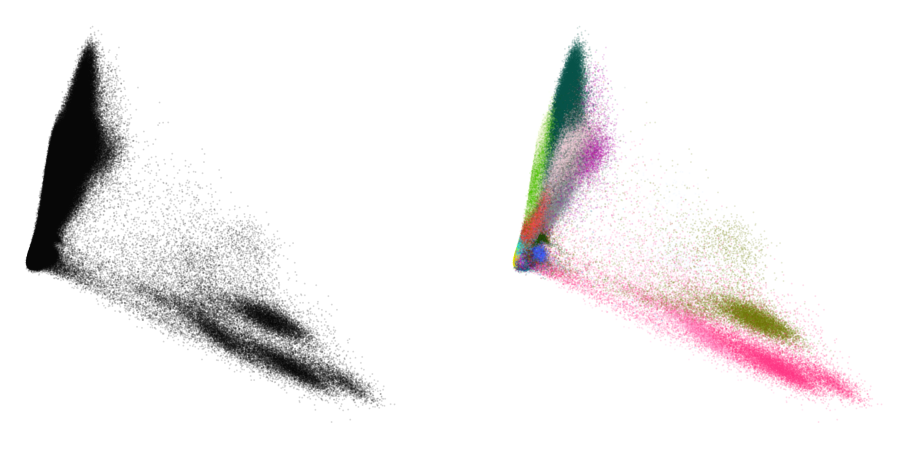
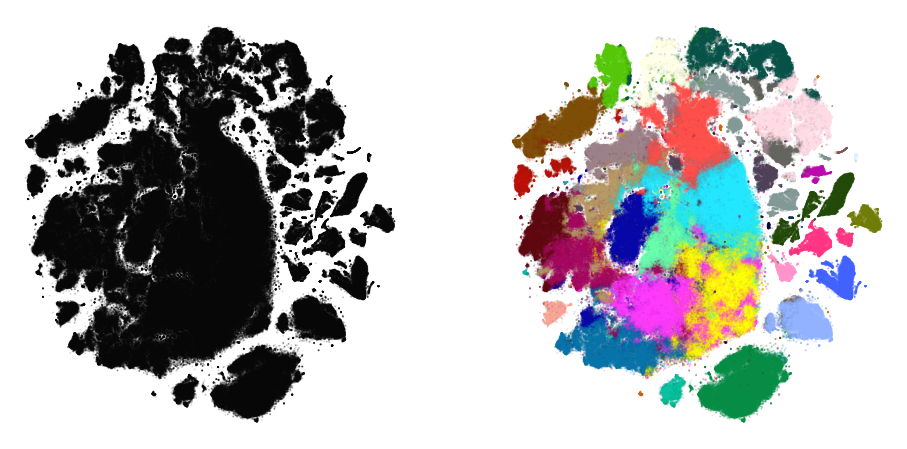
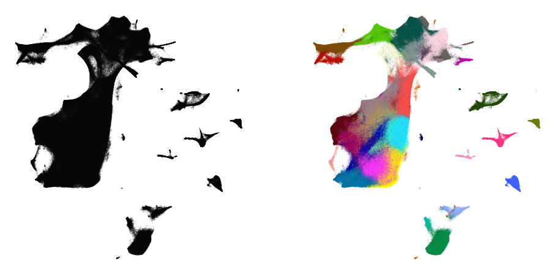
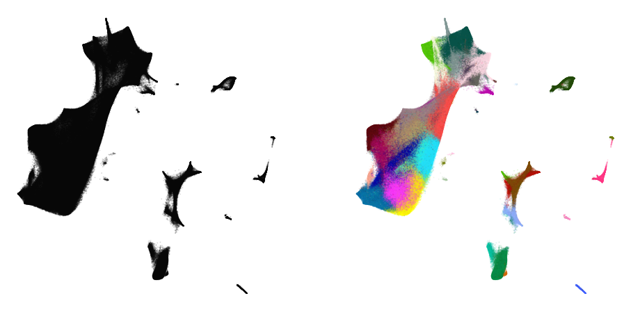
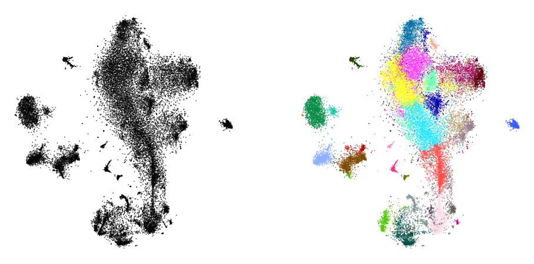
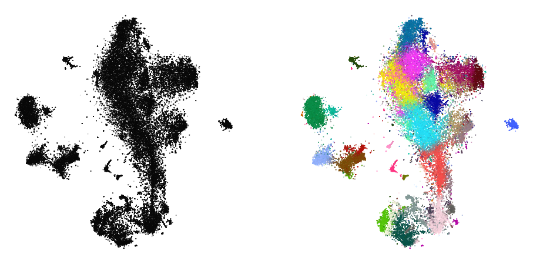
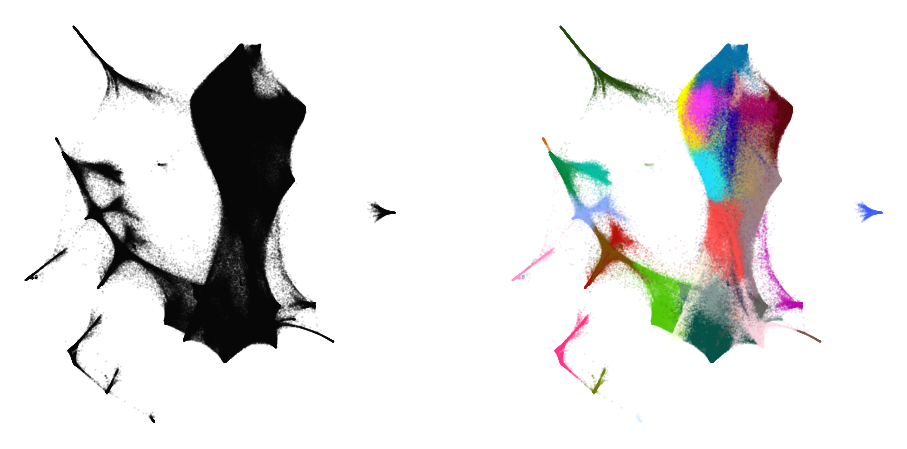
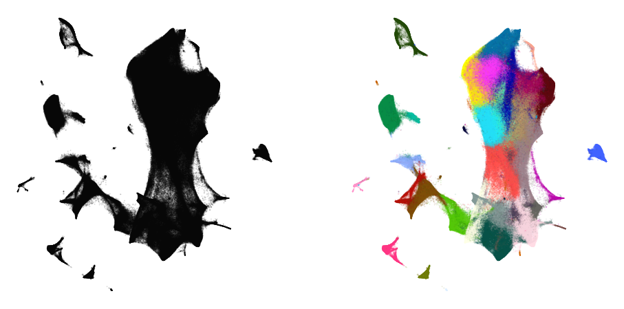
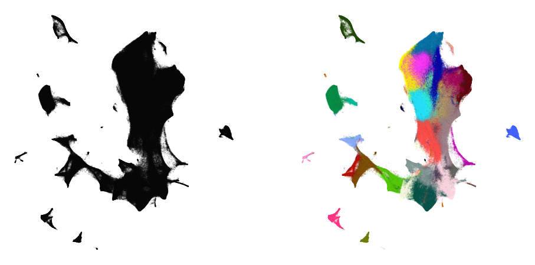
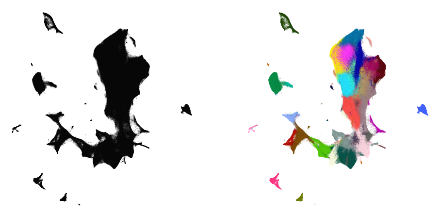

Embedding large data sets
=========================

Embedding large data sets typically requires more care. Using various
tricks described in *preserving_global_structure* can become quite slow
to run. Instead, we can take a smaller, manageable sample of our data
set, obtain a good visualization of that. Then, we can add the remaining
points to the embedding and use that as our initialization.

Remember that the initialization largely affects the structure of the
embedding. This way, our initialization provides the global structure
for the embedding, and the subsequent optimization can focus on
preserving local strucutre.

.. code:: ipython3

    import gzip
    import pickle
    
    import numpy as np
    import openTSNE
    from examples import utils
    
    import matplotlib.pyplot as plt
    %matplotlib inline

Load data
---------

The preprocessed data set can be downloaded from
http://file.biolab.si/opentsne/benchmark/10x_mouse_zheng.pkl.gz.

.. code:: ipython3

    %%time
    with gzip.open("data/10x_mouse_zheng.pkl.gz", "rb") as f:
        data = pickle.load(f)
    
    x = data["pca_50"]
    y = data["CellType1"]

.. parsed-literal::

    CPU times: user 5.88 s, sys: 2.54 s, total: 8.42 s
    Wall time: 8.42 s

.. code:: ipython3

    print("Data set contains %d samples with %d features" % x.shape)

.. parsed-literal::

    Data set contains 1306127 samples with 50 features

.. code:: ipython3

    def plot(x, y, **kwargs):
        fig, ax = plt.subplots(ncols=2, figsize=(16, 8))
        alpha = kwargs.pop("alpha", 0.1)
        utils.plot(
            x,
            np.zeros_like(y),
            ax=ax[0],
            colors={0: "k"},
            alpha=alpha,
            draw_legend=False,
            **kwargs,
        )
        utils.plot(
            x,
            y,
            ax=ax[1],
            colors=utils.MOUSE_10X_COLORS,
            alpha=alpha,
            draw_legend=False,
            **kwargs,
        )

.. code:: ipython3

    def rotate(degrees):
        phi = degrees * np.pi / 180
        return np.array([
            [np.cos(phi), -np.sin(phi)],
            [np.sin(phi), np.cos(phi)],
        ])

.. code:: ipython3

    plot(x, y)

We’ll also precompute the full affinities, since we’ll be needing it in
several places throughout the notebook, and can take a long time to run.

.. code:: ipython3

    %%time
    aff50 = openTSNE.affinity.PerplexityBasedNN(
        x,
        perplexity=50,
        n_jobs=32,
        random_state=0,
    )

.. parsed-literal::

    CPU times: user 52min 31s, sys: 1min 21s, total: 53min 53s
    Wall time: 8min 2s

.. code:: ipython3

    %%time
    aff500 = openTSNE.affinity.PerplexityBasedNN(
        x,
        perplexity=500,
        n_jobs=32,
        random_state=0,
    )

.. parsed-literal::

    CPU times: user 5h 36min 15s, sys: 8min 53s, total: 5h 45min 8s
    Wall time: 39min 40s

Standard t-SNE
--------------

First, let’s see what standard t-SNE does.

.. code:: ipython3

    # Because we're given the data representation as the top 50 principal components
    # we can just use the top 2 components as the initilization. There is no sense in
    # calculating PCA on a PCA representation
    init = openTSNE.initialization.rescale(x[:, :2])

.. code:: ipython3

    %%time
    embedding_standard = openTSNE.TSNE(
        n_jobs=32,
        verbose=True,
    ).fit(affinities=aff50, initialization=init)

.. parsed-literal::

    --------------------------------------------------------------------------------
    TSNE(early_exaggeration=12, n_jobs=32, verbose=True)
    --------------------------------------------------------------------------------
    ===> Running optimization with exaggeration=12.00, lr=108843.92 for 250 iterations...
    Iteration   50, KL divergence 8.0820, 50 iterations in 49.5503 sec
    Iteration  100, KL divergence 7.8989, 50 iterations in 52.9387 sec
    Iteration  150, KL divergence 7.8314, 50 iterations in 52.7589 sec
    Iteration  200, KL divergence 7.8026, 50 iterations in 53.2414 sec
    Iteration  250, KL divergence 7.7870, 50 iterations in 52.9956 sec
       --> Time elapsed: 261.49 seconds
    ===> Running optimization with exaggeration=1.00, lr=1306127.00 for 500 iterations...
    Iteration   50, KL divergence 5.7583, 50 iterations in 59.4852 sec
    Iteration  100, KL divergence 5.4506, 50 iterations in 60.9192 sec
    Iteration  150, KL divergence 5.2984, 50 iterations in 63.3280 sec
    Iteration  200, KL divergence 5.2018, 50 iterations in 65.2476 sec
    Iteration  250, KL divergence 5.1327, 50 iterations in 64.6718 sec
    Iteration  300, KL divergence 5.0798, 50 iterations in 66.1166 sec
    Iteration  350, KL divergence 5.0372, 50 iterations in 74.1704 sec
    Iteration  400, KL divergence 5.0017, 50 iterations in 78.6565 sec
    Iteration  450, KL divergence 4.9715, 50 iterations in 82.1395 sec
    Iteration  500, KL divergence 4.9456, 50 iterations in 92.5772 sec
       --> Time elapsed: 707.32 seconds
    CPU times: user 3h 41min 29s, sys: 10min 8s, total: 3h 51min 37s
    Wall time: 16min 14s

.. code:: ipython3

    plot(embedding_standard, y)

This doesn’t look too great. The cluster separation is quite poor and
the visualization is visually not very appealing.

Using larger exaggeration
-------------------------

Exaggeration can be used in order to get better separation between
clusters. Let’s see if that helps.

.. code:: ipython3

    %%time
    embedding_exag = openTSNE.TSNE(
        exaggeration=4,
        n_jobs=32,
        verbose=True,
    ).fit(affinities=aff50, initialization=init)

.. parsed-literal::

    --------------------------------------------------------------------------------
    TSNE(early_exaggeration=12, exaggeration=4, n_jobs=32, verbose=True)
    --------------------------------------------------------------------------------
    ===> Running optimization with exaggeration=12.00, lr=108843.92 for 250 iterations...
    Iteration   50, KL divergence 8.0820, 50 iterations in 51.7397 sec
    Iteration  100, KL divergence 7.8994, 50 iterations in 54.2033 sec
    Iteration  150, KL divergence 7.8317, 50 iterations in 54.2117 sec
    Iteration  200, KL divergence 7.8020, 50 iterations in 55.0897 sec
    Iteration   50, KL divergence 6.9432, 50 iterations in 56.7796 sec
    Iteration  100, KL divergence 6.8014, 50 iterations in 57.5679 sec
    Iteration  150, KL divergence 6.7409, 50 iterations in 56.7147 sec
    Iteration  200, KL divergence 6.7068, 50 iterations in 56.3419 sec
    Iteration  250, KL divergence 6.6856, 50 iterations in 56.2568 sec
    Iteration  300, KL divergence 6.6712, 50 iterations in 56.5754 sec
    Iteration  350, KL divergence 6.6609, 50 iterations in 56.0285 sec
    Iteration  400, KL divergence 6.6529, 50 iterations in 55.7784 sec
    Iteration  450, KL divergence 6.6468, 50 iterations in 55.4943 sec
    Iteration  500, KL divergence 6.6425, 50 iterations in 55.6567 sec
       --> Time elapsed: 563.20 seconds
    CPU times: user 3h 51min 45s, sys: 9min 50s, total: 4h 1min 35s
    Wall time: 13min 57s

.. code:: ipython3

    plot(embedding_exag, y)

The separation has improved quite a bit, but many clusters are still
intertwined with others.

Using a larger perplexity
-------------------------

.. code:: ipython3

    %%time
    embedding_aff500 = openTSNE.TSNE(
        n_jobs=32,
        verbose=True,
    ).fit(affinities=aff500, initialization=init)

.. parsed-literal::

    --------------------------------------------------------------------------------
    TSNE(early_exaggeration=12, n_jobs=32, verbose=True)
    --------------------------------------------------------------------------------
    ===> Running optimization with exaggeration=12.00, lr=108843.92 for 250 iterations...
    Iteration   50, KL divergence 5.9688, 50 iterations in 216.9035 sec
    Iteration  100, KL divergence 5.9218, 50 iterations in 218.9351 sec
    Iteration  150, KL divergence 5.8993, 50 iterations in 218.5032 sec
    Iteration  200, KL divergence 5.8900, 50 iterations in 223.6785 sec
    Iteration  250, KL divergence 5.8854, 50 iterations in 224.3249 sec
       --> Time elapsed: 1102.35 seconds
    ===> Running optimization with exaggeration=1.00, lr=1306127.00 for 500 iterations...
    Iteration   50, KL divergence 3.8664, 50 iterations in 237.2816 sec
    Iteration  100, KL divergence 3.6473, 50 iterations in 226.6633 sec
    Iteration  150, KL divergence 3.5520, 50 iterations in 235.5178 sec
    Iteration  200, KL divergence 3.4979, 50 iterations in 231.3676 sec
    Iteration  250, KL divergence 3.4621, 50 iterations in 240.6245 sec
    Iteration  300, KL divergence 3.4373, 50 iterations in 255.3066 sec
    Iteration  350, KL divergence 3.4183, 50 iterations in 241.8503 sec
    Iteration  400, KL divergence 3.4035, 50 iterations in 248.7666 sec
    Iteration  450, KL divergence 3.3922, 50 iterations in 251.1434 sec
    Iteration  500, KL divergence 3.3823, 50 iterations in 272.1862 sec
       --> Time elapsed: 2440.72 seconds
    CPU times: user 1d 2h 32min 21s, sys: 10min 19s, total: 1d 2h 42min 40s
    Wall time: 59min 32s

.. code:: ipython3

    plot(embedding_aff500, y)

.. image:: output_22_0.png

… with higher exaggeration
--------------------------

.. code:: ipython3

    %%time
    embedding_aff500_exag4 = openTSNE.TSNE(
        exaggeration=4,
        n_jobs=32,
        verbose=True,
    ).fit(affinities=aff500, initialization=init)

.. parsed-literal::

    --------------------------------------------------------------------------------
    TSNE(early_exaggeration=12, exaggeration=4, n_jobs=32, verbose=True)
    --------------------------------------------------------------------------------
    ===> Running optimization with exaggeration=12.00, lr=108843.92 for 250 iterations...
    Iteration   50, KL divergence 5.9688, 50 iterations in 215.2427 sec
    Iteration  100, KL divergence 5.9218, 50 iterations in 221.4924 sec
    Iteration  150, KL divergence 5.8993, 50 iterations in 218.4626 sec
    Iteration  200, KL divergence 5.8901, 50 iterations in 216.9501 sec
    Iteration  250, KL divergence 5.8855, 50 iterations in 217.3419 sec
       --> Time elapsed: 1089.49 seconds
    ===> Running optimization with exaggeration=4.00, lr=326531.75 for 500 iterations...
    Iteration   50, KL divergence 5.0544, 50 iterations in 216.4466 sec
    Iteration  100, KL divergence 4.9857, 50 iterations in 214.6171 sec
    Iteration  150, KL divergence 4.9611, 50 iterations in 214.4493 sec
    Iteration  200, KL divergence 4.9495, 50 iterations in 213.1030 sec
    Iteration  250, KL divergence 4.9430, 50 iterations in 214.2775 sec
    Iteration  300, KL divergence 4.9384, 50 iterations in 214.3649 sec
    Iteration  350, KL divergence 4.9351, 50 iterations in 213.4982 sec
    Iteration  400, KL divergence 4.9327, 50 iterations in 213.9199 sec
    Iteration  450, KL divergence 4.9306, 50 iterations in 213.1906 sec
    Iteration  500, KL divergence 4.9288, 50 iterations in 212.4853 sec
       --> Time elapsed: 2140.36 seconds
    CPU times: user 1d 1h 28min 18s, sys: 9min 56s, total: 1d 1h 38min 15s
    Wall time: 54min 23s

.. code:: ipython3

    plot(embedding_aff500_exag4, y)

Initialize via downsampling
---------------------------

We now perform the sample-transform trick we described above.

Create train/test split
~~~~~~~~~~~~~~~~~~~~~~~

.. code:: ipython3

    np.random.seed(0)

.. code:: ipython3

    indices = np.random.permutation(list(range(x.shape[0])))
    reverse = np.argsort(indices)
    
    x_sample, x_rest = x[indices[:25000]], x[indices[25000:]]
    y_sample, y_rest = y[indices[:25000]], y[indices[25000:]]

Create sample embedding
~~~~~~~~~~~~~~~~~~~~~~~

.. code:: ipython3

    %%time
    sample_affinities = openTSNE.affinity.PerplexityBasedNN(
        x_sample,
        perplexity=500,
        n_jobs=32,
        random_state=0,
        verbose=True,
    )

.. parsed-literal::

    ===> Finding 1500 nearest neighbors using Annoy approximate search using euclidean distance...
       --> Time elapsed: 15.41 seconds
    ===> Calculating affinity matrix...
       --> Time elapsed: 6.54 seconds
    CPU times: user 3min 39s, sys: 4.97 s, total: 3min 44s
    Wall time: 21.9 s

.. code:: ipython3

    %time sample_init = openTSNE.initialization.pca(x_sample, random_state=42)

.. parsed-literal::

    CPU times: user 5.35 s, sys: 657 ms, total: 6.01 s
    Wall time: 171 ms

.. code:: ipython3

    %time sample_embedding = openTSNE.TSNE(n_jobs=32, verbose=True).fit(affinities=sample_affinities, initialization=sample_init)

.. parsed-literal::

    --------------------------------------------------------------------------------
    TSNE(early_exaggeration=12, n_jobs=32, verbose=True)
    --------------------------------------------------------------------------------
    ===> Running optimization with exaggeration=12.00, lr=2083.33 for 250 iterations...
    Iteration   50, KL divergence 3.0347, 50 iterations in 4.0133 sec
    Iteration  100, KL divergence 3.0733, 50 iterations in 3.9727 sec
    Iteration  150, KL divergence 3.0691, 50 iterations in 4.0981 sec
    Iteration  200, KL divergence 3.0690, 50 iterations in 3.9779 sec
    Iteration  250, KL divergence 3.0690, 50 iterations in 3.9779 sec
       --> Time elapsed: 20.04 seconds
    ===> Running optimization with exaggeration=1.00, lr=25000.00 for 500 iterations...
    Iteration   50, KL divergence 1.1925, 50 iterations in 4.2847 sec
    Iteration  100, KL divergence 1.1550, 50 iterations in 4.4657 sec
    Iteration  150, KL divergence 1.1452, 50 iterations in 4.8737 sec
    Iteration  200, KL divergence 1.1407, 50 iterations in 5.5286 sec
    Iteration  250, KL divergence 1.1382, 50 iterations in 5.5675 sec
    Iteration  300, KL divergence 1.1366, 50 iterations in 5.9546 sec
    Iteration  350, KL divergence 1.1356, 50 iterations in 5.3339 sec
    Iteration  400, KL divergence 1.1349, 50 iterations in 5.9090 sec
    Iteration  450, KL divergence 1.1342, 50 iterations in 6.5074 sec
    Iteration  500, KL divergence 1.1339, 50 iterations in 5.7942 sec
       --> Time elapsed: 54.23 seconds
    CPU times: user 34min 13s, sys: 2min 15s, total: 36min 28s
    Wall time: 1min 14s

.. code:: ipython3

    plot(sample_embedding, y[indices[:25000]], alpha=0.5)

Learn the full embedding
~~~~~~~~~~~~~~~~~~~~~~~~

.. code:: ipython3

    %time rest_init = sample_embedding.prepare_partial(x_rest, k=1, perplexity=1/3)

.. parsed-literal::

    ===> Finding 1 nearest neighbors in existing embedding using Annoy approximate search...
       --> Time elapsed: 174.82 seconds
    ===> Calculating affinity matrix...
       --> Time elapsed: 0.67 seconds
    CPU times: user 4min 18s, sys: 32.3 s, total: 4min 51s
    Wall time: 2min 55s

.. code:: ipython3

    init_full = np.vstack((sample_embedding, rest_init))[reverse]

.. code:: ipython3

    plot(init_full, y)

.. code:: ipython3

    init_full = init_full / (np.std(init_full[:, 0]) * 10000)
    np.std(init_full, axis=0)

.. parsed-literal::

    array([1.00000000e-04, 1.06471542e-04])

.. code:: ipython3

    embedding = openTSNE.TSNEEmbedding(
        init_full,
        aff50,
        n_jobs=32,
        verbose=True,
        random_state=42,
    )

.. code:: ipython3

    %time embedding1 = embedding.optimize(n_iter=500, exaggeration=12)

.. parsed-literal::

    ===> Running optimization with exaggeration=12.00, lr=108843.92 for 500 iterations...
    Iteration   50, KL divergence 7.9326, 50 iterations in 48.9843 sec
    Iteration  100, KL divergence 7.8311, 50 iterations in 51.0335 sec
    Iteration  150, KL divergence 7.7772, 50 iterations in 51.2970 sec
    Iteration  200, KL divergence 7.7543, 50 iterations in 51.3436 sec
    Iteration  250, KL divergence 7.7423, 50 iterations in 51.4951 sec
    Iteration  300, KL divergence 7.7350, 50 iterations in 51.2477 sec
    Iteration  350, KL divergence 7.7299, 50 iterations in 51.5019 sec
    Iteration  400, KL divergence 7.7263, 50 iterations in 51.7564 sec
    Iteration  450, KL divergence 7.7237, 50 iterations in 51.6552 sec
    Iteration  500, KL divergence 7.7216, 50 iterations in 51.2847 sec
       --> Time elapsed: 511.60 seconds
    CPU times: user 2h 22min 35s, sys: 6min 28s, total: 2h 29min 4s
    Wall time: 8min 34s

.. code:: ipython3

    plot(embedding1, y)

.. code:: ipython3

    %time embedding2 = embedding1.optimize(n_iter=250, exaggeration=4)

.. parsed-literal::

    ===> Running optimization with exaggeration=4.00, lr=326531.75 for 250 iterations...
    Iteration   50, KL divergence 6.9325, 50 iterations in 55.0011 sec
    Iteration  100, KL divergence 6.8182, 50 iterations in 54.9294 sec
    Iteration  150, KL divergence 6.7678, 50 iterations in 54.4471 sec
    Iteration  200, KL divergence 6.7398, 50 iterations in 54.4368 sec
    Iteration  250, KL divergence 6.7219, 50 iterations in 53.8917 sec
       --> Time elapsed: 272.71 seconds
    CPU times: user 1h 13min 35s, sys: 3min 14s, total: 1h 16min 49s
    Wall time: 4min 34s

.. code:: ipython3

    plot(embedding2, y)

.. code:: ipython3

    %time embedding3 = embedding2.optimize(n_iter=250, exaggeration=4)

.. parsed-literal::

    ===> Running optimization with exaggeration=4.00, lr=326531.75 for 250 iterations...
    Iteration   50, KL divergence 6.7076, 50 iterations in 51.7026 sec
    Iteration  100, KL divergence 6.6960, 50 iterations in 51.7740 sec
    Iteration  150, KL divergence 6.6850, 50 iterations in 51.9709 sec
    Iteration  200, KL divergence 6.6749, 50 iterations in 51.9325 sec
    Iteration  250, KL divergence 6.6667, 50 iterations in 51.3449 sec
       --> Time elapsed: 258.73 seconds
    CPU times: user 1h 9min 44s, sys: 3min 14s, total: 1h 12min 58s
    Wall time: 4min 20s

.. code:: ipython3

    plot(embedding3, y)

.. code:: ipython3

    %time embedding4 = embedding3.optimize(n_iter=250, exaggeration=4)

.. parsed-literal::

    ===> Running optimization with exaggeration=4.00, lr=326531.75 for 250 iterations...
    Iteration   50, KL divergence 6.6604, 50 iterations in 51.5464 sec
    Iteration  100, KL divergence 6.6554, 50 iterations in 51.8160 sec
    Iteration  150, KL divergence 6.6514, 50 iterations in 51.7537 sec
    Iteration  200, KL divergence 6.6484, 50 iterations in 51.8397 sec
    Iteration  250, KL divergence 6.6455, 50 iterations in 51.6008 sec
       --> Time elapsed: 258.56 seconds
    CPU times: user 1h 11min 20s, sys: 3min 14s, total: 1h 14min 35s
    Wall time: 4min 20s

.. code:: ipython3

    plot(embedding4, y)

Comparison to UMAP
------------------

.. code:: ipython3

    from umap import UMAP

.. parsed-literal::

    /home/ppolicar/miniconda3/envs/tsne/lib/python3.10/site-packages/umap/distances.py:1063: NumbaDeprecationWarning: The 'nopython' keyword argument was not supplied to the 'numba.jit' decorator. The implicit default value for this argument is currently False, but it will be changed to True in Numba 0.59.0. See https://numba.readthedocs.io/en/stable/reference/deprecation.html#deprecation-of-object-mode-fall-back-behaviour-when-using-jit for details.
      @numba.jit()
    /home/ppolicar/miniconda3/envs/tsne/lib/python3.10/site-packages/umap/distances.py:1071: NumbaDeprecationWarning: The 'nopython' keyword argument was not supplied to the 'numba.jit' decorator. The implicit default value for this argument is currently False, but it will be changed to True in Numba 0.59.0. See https://numba.readthedocs.io/en/stable/reference/deprecation.html#deprecation-of-object-mode-fall-back-behaviour-when-using-jit for details.
      @numba.jit()
    /home/ppolicar/miniconda3/envs/tsne/lib/python3.10/site-packages/umap/distances.py:1086: NumbaDeprecationWarning: The 'nopython' keyword argument was not supplied to the 'numba.jit' decorator. The implicit default value for this argument is currently False, but it will be changed to True in Numba 0.59.0. See https://numba.readthedocs.io/en/stable/reference/deprecation.html#deprecation-of-object-mode-fall-back-behaviour-when-using-jit for details.
      @numba.jit()
    /home/ppolicar/miniconda3/envs/tsne/lib/python3.10/site-packages/tqdm/auto.py:21: TqdmWarning: IProgress not found. Please update jupyter and ipywidgets. See https://ipywidgets.readthedocs.io/en/stable/user_install.html
      from .autonotebook import tqdm as notebook_tqdm
    /home/ppolicar/miniconda3/envs/tsne/lib/python3.10/site-packages/umap/umap_.py:660: NumbaDeprecationWarning: The 'nopython' keyword argument was not supplied to the 'numba.jit' decorator. The implicit default value for this argument is currently False, but it will be changed to True in Numba 0.59.0. See https://numba.readthedocs.io/en/stable/reference/deprecation.html#deprecation-of-object-mode-fall-back-behaviour-when-using-jit for details.
      @numba.jit()

.. code:: ipython3

    umap = UMAP(n_neighbors=15, min_dist=0.1, random_state=1)

.. code:: ipython3

    %time embedding_umap = umap.fit_transform(x)

.. parsed-literal::

    OMP: Info #276: omp_set_nested routine deprecated, please use omp_set_max_active_levels instead.

.. parsed-literal::

    CPU times: user 9h 39min 56s, sys: 1h 17min 49s, total: 10h 57min 45s
    Wall time: 1h 21min 7s

.. code:: ipython3

    plot(embedding_umap, y)

.. image:: output_53_0.png

