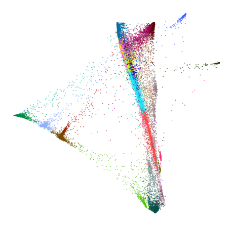
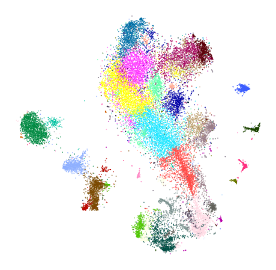
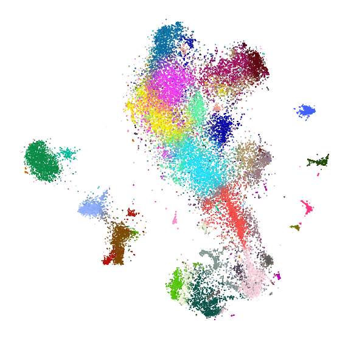
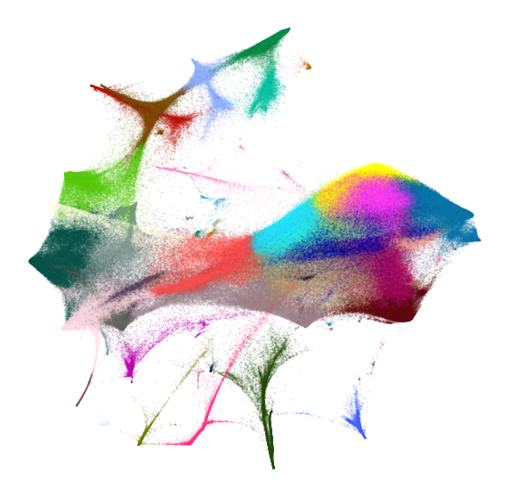
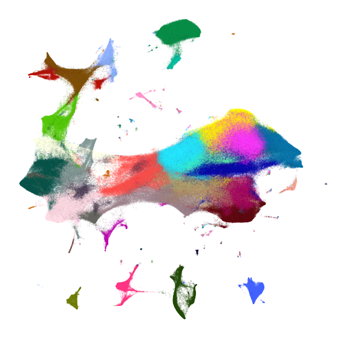
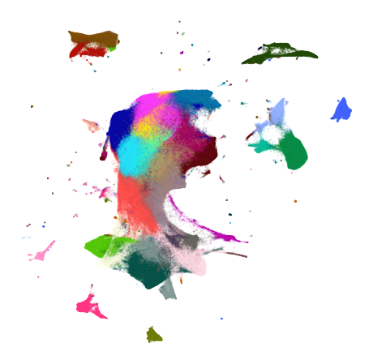

Embedding large data sets
=========================

Embedding large data sets typically requires more care. Using various
tricks described in *preserving_global_structure* can become quite slow
to run. Instead, we can take a smaller, manageable sample of our data
set, obtain a good visualization of that. Then, we can add the remaining
points to the embedding and use that as our initialization.

Remember that the initialization largely affects the structure of the
embedding. This way, our initialization provides the global structure
for the embedding, and the subsequent optimization can focus on
preserving local strucutre.

.. code:: ipython3

    from openTSNE import TSNE, TSNEEmbedding, affinity, initialization
    from openTSNE import initialization
    from openTSNE.callbacks import ErrorLogger
    
    from examples import utils
    
    import numpy as np
    
    import matplotlib.pyplot as plt

Load data
---------

.. code:: ipython3

    import gzip
    import pickle
    
    with gzip.open("data/10x_mouse_zheng.pkl.gz", "rb") as f:
        data = pickle.load(f)
    
    x = data["pca_50"]
    y = data["CellType1"]

.. code:: ipython3

    print("Data set contains %d samples with %d features" % x.shape)

.. parsed-literal::

    Data set contains 1306127 samples with 50 features

.. code:: ipython3

    def plot(x, y, **kwargs):
        utils.plot(
            x,
            y,
            colors=utils.MOUSE_10X_COLORS,
            alpha=kwargs.pop("alpha", 0.1),
            draw_legend=False,
            **kwargs,
        )

.. code:: ipython3

    def rotate(degrees):
        phi = degrees * np.pi / 180
        return np.array([
            [np.cos(phi), -np.sin(phi)],
            [np.sin(phi), np.cos(phi)],
        ])

.. code:: ipython3

    plot(x, y)

.. image:: output_7_0.png

We’ll also precompute the full affinities, since we’ll be needing it in
several places throughout the notebook, and can take a long time to run.

.. code:: ipython3

    %%time
    affinities = affinity.PerplexityBasedNN(
        x,
        perplexity=30,
        n_jobs=8,
        random_state=0,
    )

.. parsed-literal::

    CPU times: user 1h 2min 57s, sys: 1min 47s, total: 1h 4min 44s
    Wall time: 37min 40s

Standard t-SNE
--------------

First, let’s see what standard t-SNE does.

.. code:: ipython3

    %time init = initialization.pca(x, random_state=0)

.. parsed-literal::

    CPU times: user 2min 46s, sys: 8.71 s, total: 2min 54s
    Wall time: 5.27 s

.. code:: ipython3

    embedding_standard = TSNEEmbedding(
        init,
        affinities,
        negative_gradient_method="fft",
        n_jobs=8,
    )

.. code:: ipython3

    %%time
    embedding_standard.optimize(n_iter=250, exaggeration=12, momentum=0.5, inplace=True)
    embedding_standard.optimize(n_iter=750, exaggeration=1, momentum=0.8, inplace=True)

.. parsed-literal::

    CPU times: user 4h 22min 22s, sys: 5min 47s, total: 4h 28min 10s
    Wall time: 16min 1s

.. code:: ipython3

    plot(embedding_standard, y)

.. image:: output_14_0.png

This doesn’t look too great. The cluster separation is quite poor and
the visualization is visually not very appealing.

Using exaggeration
------------------

Exaggeration can be used in order to get better separation between
clusters. Let’s see if that helps.

.. code:: ipython3

    %time init = initialization.pca(x, random_state=0)

.. parsed-literal::

    CPU times: user 2min 47s, sys: 7.07 s, total: 2min 54s
    Wall time: 5.55 s

.. code:: ipython3

    embedding_exag = TSNEEmbedding(
        init,
        affinities,
        negative_gradient_method="fft",
        n_jobs=8,
    )

.. code:: ipython3

    %%time
    embedding_exag.optimize(n_iter=250, exaggeration=12, momentum=0.5, inplace=True)
    embedding_exag.optimize(n_iter=750, exaggeration=4, momentum=0.8, inplace=True)

.. parsed-literal::

    CPU times: user 4h 19min 6s, sys: 4min 51s, total: 4h 23min 57s
    Wall time: 15min 38s

.. code:: ipython3

    plot(embedding_exag, y)

.. image:: output_20_0.png

The separation has improved quite a bit, but many clusters are still
intertwined with others.

With downsampling
-----------------

We now perform the sample-transform trick we described above.

Create train/test split
~~~~~~~~~~~~~~~~~~~~~~~

.. code:: ipython3

    np.random.seed(0)

.. code:: ipython3

    indices = np.random.permutation(list(range(x.shape[0])))
    reverse = np.argsort(indices)
    
    x_sample, x_rest = x[indices[:25000]], x[indices[25000:]]
    y_sample, y_rest = y[indices[:25000]], y[indices[25000:]]

Create sample embedding
~~~~~~~~~~~~~~~~~~~~~~~

.. code:: ipython3

    %%time
    sample_affinities = affinity.PerplexityBasedNN(
        x_sample,
        perplexity=500,
        method="approx",
        n_jobs=8,
        random_state=0,
    )

.. parsed-literal::

    CPU times: user 9min 18s, sys: 6.92 s, total: 9min 25s
    Wall time: 2min 1s

.. code:: ipython3

    %time sample_init = initialization.pca(x_sample, random_state=42)

.. parsed-literal::

    CPU times: user 2.33 s, sys: 90.3 ms, total: 2.42 s
    Wall time: 62.2 ms

.. code:: ipython3

    sample_embedding = TSNEEmbedding(
        sample_init,
        sample_affinities,
        negative_gradient_method="fft",
        n_jobs=8,
        callbacks=ErrorLogger(),
    )

.. code:: ipython3

    %time sample_embedding1 = sample_embedding.optimize(n_iter=250, exaggeration=12, momentum=0.5)

.. parsed-literal::

    Iteration   50, KL divergence  3.1703, 50 iterations in 5.7042 sec
    Iteration  100, KL divergence  3.0518, 50 iterations in 6.0842 sec
    Iteration  150, KL divergence  3.0461, 50 iterations in 5.6341 sec
    Iteration  200, KL divergence  3.0447, 50 iterations in 6.5530 sec
    Iteration  250, KL divergence  3.0441, 50 iterations in 5.5155 sec
    CPU times: user 12min, sys: 10 s, total: 12min 10s
    Wall time: 29.9 s

.. code:: ipython3

    plot(sample_embedding1, y[indices[:25000]], alpha=0.5)

.. code:: ipython3

    %time sample_embedding2 = sample_embedding1.optimize(n_iter=750, exaggeration=1, momentum=0.8)

.. parsed-literal::

    Iteration   50, KL divergence  1.5264, 50 iterations in 6.6760 sec
    Iteration  100, KL divergence  1.3347, 50 iterations in 6.5701 sec
    Iteration  150, KL divergence  1.2537, 50 iterations in 5.7738 sec
    Iteration  200, KL divergence  1.2109, 50 iterations in 6.0972 sec
    Iteration  250, KL divergence  1.1856, 50 iterations in 6.1227 sec
    Iteration  300, KL divergence  1.1694, 50 iterations in 5.8382 sec
    Iteration  350, KL divergence  1.1599, 50 iterations in 6.1803 sec
    Iteration  400, KL divergence  1.1536, 50 iterations in 5.6595 sec
    Iteration  450, KL divergence  1.1500, 50 iterations in 6.1716 sec
    Iteration  500, KL divergence  1.1465, 50 iterations in 6.5309 sec
    Iteration  550, KL divergence  1.1440, 50 iterations in 6.5737 sec
    Iteration  600, KL divergence  1.1418, 50 iterations in 6.4968 sec
    Iteration  650, KL divergence  1.1402, 50 iterations in 5.2163 sec
    Iteration  700, KL divergence  1.1388, 50 iterations in 5.6052 sec
    Iteration  750, KL divergence  1.1373, 50 iterations in 6.2774 sec
    CPU times: user 36min 50s, sys: 30.9 s, total: 37min 21s
    Wall time: 1min 32s

.. code:: ipython3

    plot(sample_embedding2, y[indices[:25000]], alpha=0.5)

Learn the full embedding
~~~~~~~~~~~~~~~~~~~~~~~~

.. code:: ipython3

    %time rest_init = sample_embedding2.prepare_partial(x_rest, k=1, perplexity=1/3)

.. parsed-literal::

    CPU times: user 2min 37s, sys: 652 ms, total: 2min 38s
    Wall time: 1min 18s

.. code:: ipython3

    init_full = np.vstack((sample_embedding2, rest_init))[reverse]

.. code:: ipython3

    fig, ax = plt.subplots(figsize=(10, 10))
    plot(init_full, y, ax=ax)

.. code:: ipython3

    init_full = init_full / (np.std(init_full[:, 0]) * 10000)
    np.std(init_full, axis=0)

.. parsed-literal::

    array([1.00000000e-04, 1.14353061e-04])

.. code:: ipython3

    embedding = TSNEEmbedding(
        init_full,
        affinities,
        learning_rate=1000,
        negative_gradient_method="fft",
        n_jobs=8,
        callbacks=ErrorLogger(),
        random_state=42,
    )

.. code:: ipython3

    %time embedding1 = embedding.optimize(n_iter=500, exaggeration=12, momentum=0.5)

.. parsed-literal::

    Iteration   50, KL divergence  10.2843, 50 iterations in 48.5307 sec
    Iteration  100, KL divergence  10.2803, 50 iterations in 48.2069 sec
    Iteration  150, KL divergence  9.3181, 50 iterations in 47.9606 sec
    Iteration  200, KL divergence  8.7442, 50 iterations in 48.3420 sec
    Iteration  250, KL divergence  8.5049, 50 iterations in 48.1888 sec
    Iteration  300, KL divergence  8.3797, 50 iterations in 48.1925 sec
    Iteration  350, KL divergence  8.3061, 50 iterations in 48.5544 sec
    Iteration  400, KL divergence  8.2591, 50 iterations in 48.4718 sec
    Iteration  450, KL divergence  8.2273, 50 iterations in 48.4514 sec
    Iteration  500, KL divergence  8.2049, 50 iterations in 48.4425 sec
    CPU times: user 2h 15min 27s, sys: 2min 28s, total: 2h 17min 56s
    Wall time: 8min 5s

.. code:: ipython3

    fig, ax = plt.subplots(figsize=(10, 10))
    plot(embedding1 @ rotate(90), y, ax=ax)

.. code:: ipython3

    %time embedding2 = embedding1.optimize(n_iter=250, exaggeration=4, momentum=0.8)

.. parsed-literal::

    Iteration   50, KL divergence  7.6311, 50 iterations in 54.7087 sec
    Iteration  100, KL divergence  7.4543, 50 iterations in 48.5959 sec
    Iteration  150, KL divergence  7.3482, 50 iterations in 48.6267 sec
    Iteration  200, KL divergence  7.2778, 50 iterations in 48.8663 sec
    Iteration  250, KL divergence  7.2278, 50 iterations in 48.9803 sec
    CPU times: user 1h 7min 26s, sys: 1min 16s, total: 1h 8min 43s
    Wall time: 4min 12s

.. code:: ipython3

    fig, ax = plt.subplots(figsize=(10, 10))
    plot(embedding2 @ rotate(90), y, ax=ax)

.. code:: ipython3

    %time embedding3 = embedding2.optimize(n_iter=250, exaggeration=4, momentum=0.8)

.. parsed-literal::

    Iteration   50, KL divergence  7.1927, 50 iterations in 47.5765 sec
    Iteration  100, KL divergence  7.1623, 50 iterations in 47.2527 sec
    Iteration  150, KL divergence  7.1375, 50 iterations in 47.1718 sec
    Iteration  200, KL divergence  7.1169, 50 iterations in 47.1572 sec
    Iteration  250, KL divergence  7.0995, 50 iterations in 47.5738 sec
    CPU times: user 1h 6min 21s, sys: 1min 12s, total: 1h 7min 33s
    Wall time: 3min 59s

.. code:: ipython3

    fig, ax = plt.subplots(figsize=(10, 10))
    plot(embedding3 @ rotate(90), y, ax=ax)

.. code:: ipython3

    %time embedding4 = embedding3.optimize(n_iter=250, exaggeration=4, momentum=0.8)

.. parsed-literal::

    Iteration   50, KL divergence  7.0854, 50 iterations in 47.2708 sec
    Iteration  100, KL divergence  7.0716, 50 iterations in 47.4487 sec
    Iteration  150, KL divergence  7.0592, 50 iterations in 47.5619 sec
    Iteration  200, KL divergence  7.0478, 50 iterations in 47.1930 sec
    Iteration  250, KL divergence  7.0381, 50 iterations in 47.6492 sec
    CPU times: user 1h 6min 45s, sys: 1min 14s, total: 1h 7min 59s
    Wall time: 3min 59s

.. code:: ipython3

    fig, ax = plt.subplots(figsize=(10, 10))
    plot(embedding4 @ rotate(90), y, ax=ax)

Comparison to UMAP
------------------

.. code:: ipython3

    from umap import UMAP

.. parsed-literal::

    /home/ppolicar/local/miniconda3/envs/tsne/lib/python3.7/site-packages/scikit_learn-0.21.0-py3.7-linux-x86_64.egg/sklearn/externals/joblib/__init__.py:15: DeprecationWarning: sklearn.externals.joblib is deprecated in 0.21 and will be removed in 0.23. Please import this functionality directly from joblib, which can be installed with: pip install joblib. If this warning is raised when loading pickled models, you may need to re-serialize those models with scikit-learn 0.21+.
      warnings.warn(msg, category=DeprecationWarning)

.. code:: ipython3

    umap = UMAP(n_neighbors=15, min_dist=0.1, random_state=1)

.. code:: ipython3

    %time embedding_umap = umap.fit_transform(x)

.. parsed-literal::

    CPU times: user 11h 1min 37s, sys: 18min 41s, total: 11h 20min 19s
    Wall time: 1h 24min 29s

.. code:: ipython3

    plot(embedding_umap, y)

