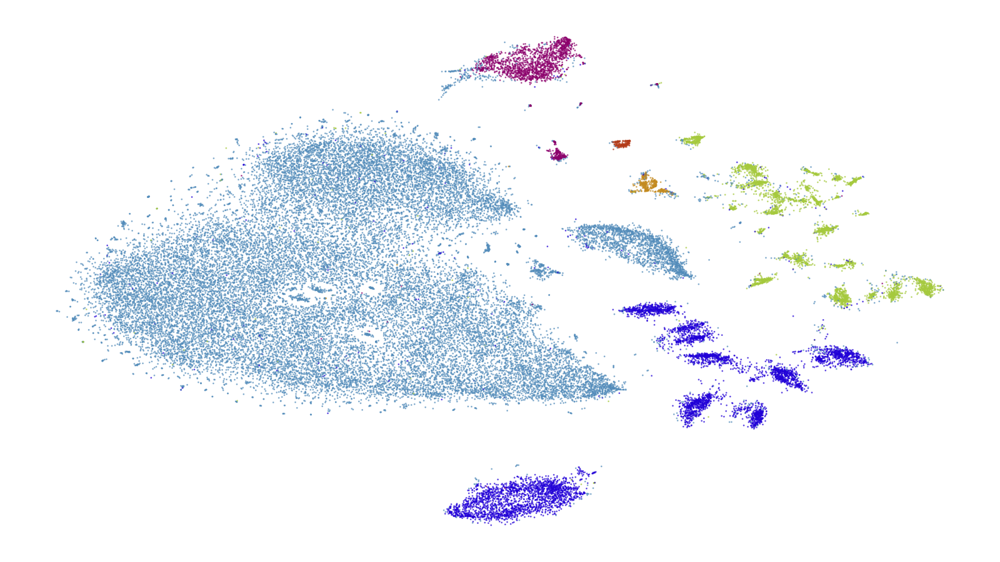

openTSNE: Extensible, parallel implementations of t-SNE
=======================================================

t-Distributed Stochastic Neighbor Embedding or t-SNE is a popular non-linear dimensionality reduction technique that can be used for visualizing high dimensional data sets [1]_.

t-SNE has had several criticisms over the years, which we will address here:

1. t-SNE is *slow*. This criticism likely comes from the fact that some popular packages have slow implementations of t-SNE. Until fairly recently, t-SNE did not scale well to larger data sets, however recent theoretical advances by Linderman et. al. [2]_ have made t-SNE one of the fastest non-linear dimensionality reduction methods available, capable of scaling to millions of samples.

2. t-SNE does not preserve *global structure*. The objective of t-SNE is to preserve local structure i.e. samples close to one another in the input space remain close to each other in the embedded space. This can lead to similar clusters of data points drifting to different regions of the embedding space. Recently, Kobak and Berens [3]_ introduced a range of tricks that address this problem and better preserve global structure.

3. t-SNE is nonparametric therefore it is impossible to add *new samples* to an existing embedding. This argument is often repeated and likely comes from the fact that most software packages simply did not take the time to implement this functionality. t-SNE is nonparametric meaning that it does not learn a function :math:`f` that projects samples from the ambient space into the embedding space. However, the objective function of t-SNE is well defined and new samples can easily be added into an existing embedding by taking a data point and optimizing its position with respect to the existing embedding. This is the only available implementation we know of that allows adding new points to an existing embedding.

    A visualization of 44,808 single cell transcriptomes from the mouse retina embedded using the multiscale kernel trick for preserving global structure.

The goal of this project is

1. **Extensibility**. We provide efficient defaults for the typical use case. We make it very easy to use various tricks that have been introduced to improve the quality of t-SNE embeddings. The library is designed to be extensible and it is easy to implement and use your own components and makes experimentation very simple.

2. **Speed**. We provide two fast, parallel implementations of t-SNE, which are comparable to their C++ counterparts in speed. Python does incur some overhead, so if speed is your only requirement, consider using `FIt-SNE <https://github.com/KlugerLab/FIt-SNE>`_. The differences are often minute and become even less apparent when utilizing multiple cores.

3. **Interactivity**. This library was built for Orange, an interactive machine learning toolkit. As such, we provide a powerful API which can control all aspects of the t-SNE algorithm and makes it suitable for interactive environments.

4. **Ease of distribution**. FIt-SNE, the reference C++ implementation for t-SNE, is not easy to install or distribute. It requires one to preinstall C libraries and requires manual compilation. This package is installable either through :code:`pip` or :code:`conda` with a single command, making it very easy to include in other packages.

.. toctree::
    :maxdepth: 2
    :caption: User Guide

    installation
    examples/index
    tsne_algorithm
    parameters
    benchmarks

.. toctree::
    :maxdepth: 2
    :caption: API Reference

    api/index

References
----------

.. [1] Maaten, Laurens van der, and Geoffrey Hinton. "Visualizing data using t-SNE." Journal of machine learning research 9.Nov (2008): 2579-2605.

.. [2] Linderman, George C., et al. "Efficient Algorithms for t-distributed Stochastic Neighborhood Embedding." arXiv preprint arXiv:1712.09005 (2017).

.. [3] Kobak, Dmitry, and Philipp Berens. "The art of using t-SNE for single-cell transcriptomics." bioRxiv (2018): 453449.
