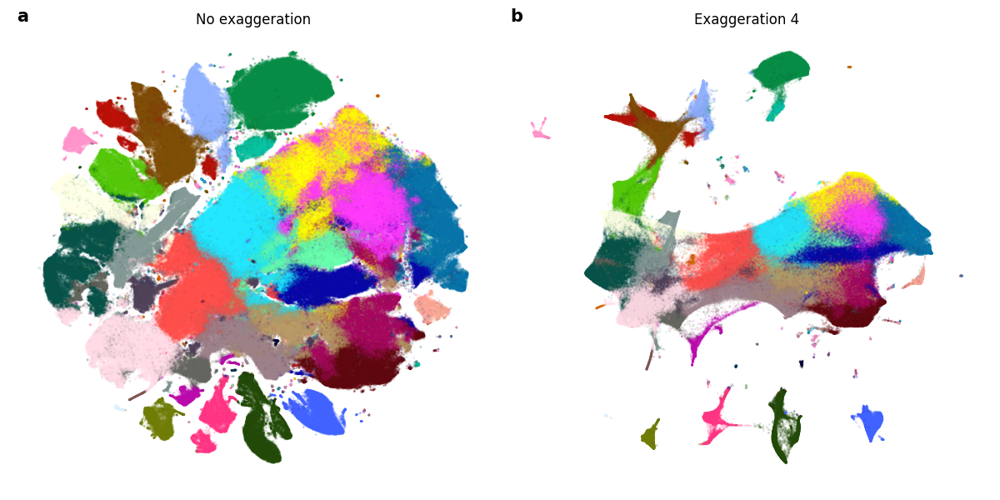

.. _parameter-guide:

Parameter guide
===============

Perplexity
----------
Perplexity is perhaps the most important parameter in t-SNE and can reveal different aspects of the data. Considered loosely, it can be thought of as the balance between preserving the global and the local structure of the data. A more direct way to think about perplexity is that it is the continuous analogy to the :math:`k` number of nearest neighbors for which we will preserve distances.

In most implementations, perplexity defaults to 30. This focuses the attention of t-SNE on preserving the distances to its 30 nearest neighbors and puts virtually no weight on preserving distances to the remaining points. For data sets with a small number of points e.g. 100, this will uncover the global structure quite well since each point will preserve distances to a third of the data set.

For larger data sets, e.g. 10,000 points, considering 30 nearest neighbors will likely do a poor job of preserving global structure. Using a higher perplexity value e.g. 500, will do a much better job for of uncovering the global structure. For larger data sets still e.g. 500k or 1 million samples, this is typically not enough and can take quite a long time to run. Luckily, various tricks can be used to improve global structure [1]_.

.. figure:: images/macosko_perplexity.png

    **Figure 1**: Higher values of perplexity do a better job of preserving global structure, but can obscure local structure. In both a) and b) we run standard t-SNE with perplexities 30 and 500, respectively.

Note that perplexity linearly impacts runtime i.e. higher values of
perplexity will incur longer execution time. For example, the embedding in Figure 1a took around 1 minute 30 seconds to compute, while Figure 1b took around 6 minutes.

Exaggeration
------------

The exaggeration factor is typically used during the early exaggeration phase. This factor increases the attractive forces between points and allows points to move around more freely, finding their nearest neighbors more easily. The most typical value of exaggeration during the early exaggeration phase is 12, but higher values have also been shown to work in combination with different learning rates [2]_.

Exaggeration can also be used during the normal optimization regime to form more densely packed clusters, making the separation between clusters more visible [1]_.

    **Figure 2**: We run t-SNE twice on the 10x genomics mouse brain data set, containing 1,306,127 samples. a) t-SNE was run with the regular early exaggeration phase 12 for 500 iterations, then in the regular regime with no exaggeration for 750 iterations. b) t-SNE was run  with the regular early exaggeration phase 12 for 500 iterations, then for another 750 iterations with exaggeration 4.

Optimization parameters
-----------------------

t-SNE uses a variation of gradient descent optimization procedure that incorporates momentum to speed up convergence of the embedding [3]_.

learning_rate: float
    The learning rate controls the step size of the gradient updates. This typically ranges from 100 to 1000, but usually the default (200) works well enough.

    When dealing with large data sets e.g 500k samples or more, it may be necessary to increase the learning rate or to increase the number of iterations [1]_.

momentum: float
    Gradient descent with momentum keeps a sum exponentially decaying weights from previous iterations, speeding up convergence. In early stages of the optimization, this is typically set to a lower value (0.5 in most implementations) since points generally move around quite a bit in this phase and increased after the initial early exaggeration phase (typically to 0.8) to speed up convergence.

Barnes-Hut parameters
---------------------

Please refer to :ref:`barnes-hut` for a description of the Barnes-Hut algorithm.

theta: float
    The trade-off parameter between accuracy and speed.

Interpolation parameters
------------------------

Please refer to :ref:`fit-sne` for a description of the interpolation-based algorithm.

n_interpolation_points: int
    The number of interpolation points to use within each grid cell. It is highly recommended leaving this at the default value due to the Runge phenomenon described above.

min_num_intervals: int
    This value indicates what the minimum number of intervals/cells should be in any dimension.

ints_in_interval: float
    Our implementation dynamically determines the number of cells such that the accuracy for any given interval remains fixed. This value indicates the size of the interval/cell in any dimension e.g. setting this value to 3 indicates that all the cells should have side length of 3.

References
----------
.. [1] Kobak, Dmitry, and Philipp Berens. "The art of using t-SNE for single-cell transcriptomics." bioRxiv (2018): 453449.

.. [2] Linderman, George C., and Stefan Steinerberger. "Clustering with t-SNE, provably." arXiv preprint arXiv:1706.02582 (2017).

.. [3] Jacobs, Robert A. "Increased rates of convergence through learning rate adaptation." Neural networks 1.4 (1988): 295-307.
