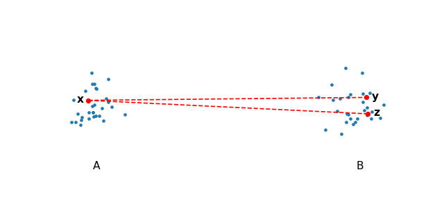
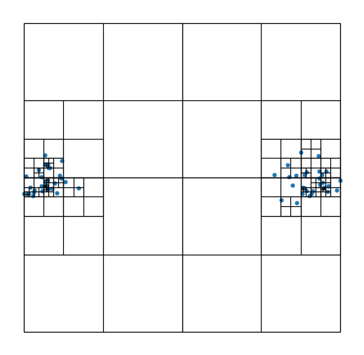
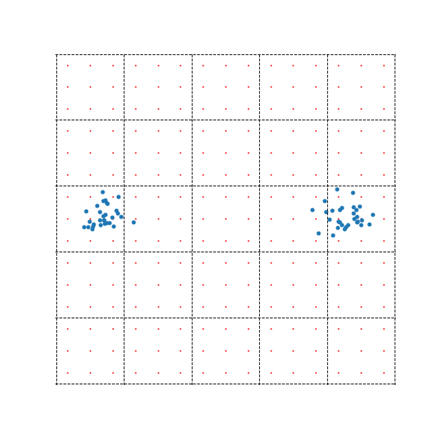
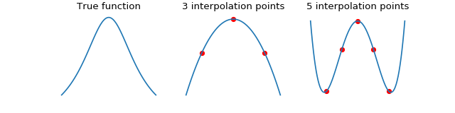
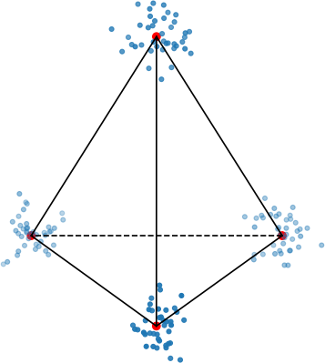
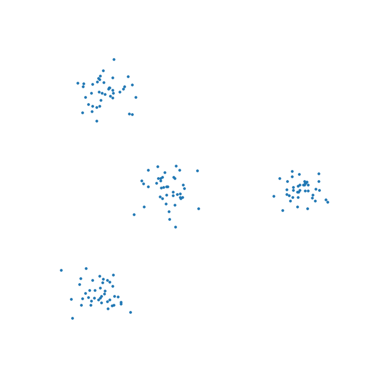
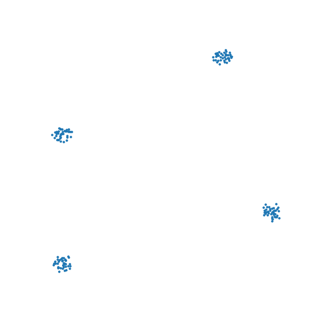

How t-SNE works
===============

t-Distributed Stochastic Neighbor Embedding [1]_ or t-SNE is a popular non-linear dimensionality reduction technique used for visualizing high dimensional data sets.

In this section, we describe the algorithm in a way that will hopefully be accessible to most audiences. We skip much of the mathematical rigour but provide references where necessary. This way, we hope to bring intuition to how t-SNE works, where it can shine and when and why it can fail.

t-SNE
-----

Given a :math:`D`-dimensional data set :math:`\mathbf{X} \in \mathbb{R}^D`, t-SNE aims to produce a low dimensional embedding :math:`\mathbf{Y} \in \mathbb{R}^d` where :math:`d` is much smaller than :math:`D`, typically 2, such that if two points :math:`\mathbf{x}_i` and :math:`\mathbf{x}_j` are close to one another in the input space :math:`\mathbf{X}`, then their corresponding lower dimensional points :math:`\mathbf{y}_i` and :math:`\mathbf{y}_j` are also close.

In order to achieve this, t-SNE models similarities in the input and embedding space as probability densities. In the input space, the similarities are given by a Gaussian distribution.

.. math::

    p_{j \mid i} = \frac{\exp{\left (- || \mathbf{x}_i - \mathbf{x}_j ||^2 / 2\sigma_i^2 \right )}}{\sum_{k \neq i}\exp{\left (- || \mathbf{x}_i - \mathbf{x}_k ||^2 / 2\sigma_i^2 \right )}}

These conditional probabilities are then typically symmetrized to obtain joint probabilities :math:`p_{ij}`.

.. math::

    p_{ij} = \frac{p_{j\mid i} + p_{i \mid j}}{2}

In the embedding space, we replace the Gaussian distribution with the Student's t-distribution is used, hence the name *t*-SNE. The t-distribution has fatter tails, allowing some distances to be less faithfully preserved in the embedding.

.. math::

    q_{ij} = \frac{\left ( 1 + || \mathbf{y}_i - \mathbf{y}_j ||^2 \right )^{-1}}{\sum_{k \neq l}\left ( 1 + || \mathbf{y}_k - \mathbf{y}_l ||^2 \right )^{-1}}

Our goal, now, is to make :math:`\mathbf{Q}` as similar to :math:`\mathbf{P}` as possible. A well-known measure of similarity between two probability distributions is the Kullback–Leibler divergence and is given by

.. math::

    C = KL(\mathbf{P} \mid \mid \mathbf{Q}) = \sum_{ij} p_{ij} \log \frac{p_{ij}}{q_{ij}}

We have now fully specified our model. We have two probability distributions describing the input and embedding spaces and we have a cost function that tells us how good our embedding is. The only thing remaining is to optimize the cost function. One simple way to optimize differentiable cost functions is gradient descent. To perform gradient descent, we need to work out the gradient, which will be used to update :math:`\mathbf{Y}`. The full derivation can be found in [1]_. The gradient of the cost KL divergence is given by

.. math::

    \frac{\partial C}{\partial \mathbf{y}_i} = 4 \sum_{j \neq i} \left ( p_{ij} - q_{ij} \right ) \left ( \mathbf{y}_i - \mathbf{y}_j \right ) \left ( 1 + || \mathbf{y}_i - \mathbf{y}_j || ^2 \right )^{-1}

One last thing we have not yet mentioned how to set the bandwidths :math:`\sigma_i` for the Gaussian kernels centered over each data point in the input space. It is unlikely that one single value of :math:`\sigma_i` is optimal for all data points because the density of the data is likely to vary. In dense regions, a smaller value of :math:`\sigma_i` is usually more appropriate than in sparser regions. Perplexity is defined as

.. math::

    \text{Perplexity}(\textbf{p}_i) = 2^{H(\textbf{p}_i)}

where :math:`H` is the Shannon entropy of a discrete distribution

.. math::

    H(\textbf{p}_i) = -\sum_i p_{j \mid i} \log_2 (p_{j \mid i})

Perplexity can be thought of as a continuous analogue to the :math:`k` nearest neighbours, to which t-SNE will attempt to preserve distances. More concretely, the bandwidths :math:`\sigma_i` are set such that each Gaussian kernel fits :math:`k` nearest neighbors within one standard deviation of the probability density.

And that's it! You now know what t-SNE is and what it does.

Accelerations
-------------

Unfortunately, a direct implementation of t-SNE is rather slow. It's easy to see that that computing all the :math:`p_{ij}` and :math:`q_{ij}` requires computing all pair-wise interactions between points and has time complexity :math:`\mathcal{O}(N^2)`. This quickly becomes far too slow for any reasonably sized data set. Moreover, the normalization constant for :math:`q_{ij}` must be computed in every single iteration of the optimization, while :math:`p_{ij}` can be computed only once, since the points in the input space stay fixed.

Most of the subsequent research on t-SNE has focused on how to accelerate the computation of :math:`p_{ij}` and :math:`q_{ij}`.

We will begin by rewriting the gradient update rule in the following form

.. math::

    \frac{\partial C}{\partial \mathbf{y}_i} = 4 \left (\sum_{j \neq i} p_{ij} q_{ij} Z \left ( \mathbf{y}_i - \mathbf{y}_j \right ) -\sum_{j \neq i} q_{ij}^2 Z \left ( \mathbf{y}_i - \mathbf{y}_j \right ) \right )

where :math:`Z` is defined as the normalization constant in :math:`q_{ij}`

.. math::

    Z = \sum_{k \neq l}\left ( 1 + || \mathbf{y}_k - \mathbf{y}_l ||^2 \right )^{-1}

This equation splits the gradient into two parts which can be interpreted as the attractive and repulsive forces between points in the embedding. The first term includes :math:`p_{ij}`, encouraging nearby points to remain close to each other. The repulsive forces have the natural interpretation of the N-body problem, where all data points exert forces on each other. The optimization process finds an equilibrium between these two forces.

Attractive forces
#################

First, we will address how to speed up the computation of the attractive forces. In practice, this means speeding up the computation of the input similarities :math:`p_{ij}`. These can be precomputed once before the optimization as the points in the input space remain fixed.

Only nearest neighbors
~~~~~~~~~~~~~~~~~~~~~~

The first improvement for the computation of the input similarities :math:`p_{ij}` in the input space comes from observing that points further than :math:`3 \sigma` have nearly infinitesimally small probabilities. These :math:`p_{ij}` have practically zero contribution to the KL divergence and can be ignored. Because of the way these bandwidths are computed, it is reasonable to compute and consider only the :math:`\lfloor 3 * \text{Perplexity} \rfloor` nearest neighbors of each data point and ignore points further away. This means that the affinity matrix :math:`\mathbf{P}` becomes sparse, and computing the :math:`p_{ij}` values includes summing up only the non-zero entries [2]_.

Approximate neighbors
~~~~~~~~~~~~~~~~~~~~~

The second, more recent improvement comes from a theoretical advance which claims that using approximate nearest neighbors works just as well as using exact nearest neighbors. We do not attempt to justify this approach here but the interested reader can find proof in [3]_.

Previously, the :math:`k` nearest neighbors were computed using Vantage Point trees, which have time complexity :math:`\mathcal{O}(N \log N)`, which becomes too expensive with large data sets. Replacing this with approximate methods can lower this time complexity, allowing us to compute :math:`p_{ij}` for millions of data points in a reasonable amount of time.

Repulsive forces
################

We next show how to accelerate the computation of the second term i.e. the repulsive forces. As previously mentioned, these have a natural interpretation of an N-body problem.

.. _barnes-hut:

Barnes-Hut t-SNE
~~~~~~~~~~~~~~~~

The first major acceleration draws from particle simulations, which use space partitioning trees to approximate repulsive forces. These are made possible by the observation that given two well-separated clusters of points :math:`A` and :math:`B`, choose :math:`x \in A` and :math:`y, z \in B` and notice that the repulsive forces from :math:`y` onto :math:`x` will be roughly the same as :math:`z` onto :math:`x`.

This is true for any point in :math:`A` and :math:`B`, therefore we can compute the interaction for all points from :math:`B` onto any point in :math:`A` by simply computing the center of mass in :math:`B` and using that as a summary for all the points in :math:`A`.

The Barnes-Hut tree algorithm [2]_ exploits this fact by constructing a quad-tree and at every node in the tree, deciding whether the center of mass can be used as a summary for all the points in that cell.

    A quad tree evenly splits the space until there is a single point in every cell.

Let's now make precise when a cell can be used as a summary for some point.
The condition compares the distance between the cell and the target point and the size of cell with the following criterion:

.. math::

    \frac{r_{\text{cell}}}{|| \textbf{y}_i - \textbf{y}_{\text{cell}} ||^2} < \theta

where :math:`r_{\text{cell}}` is the length of the diagonal in the cell and :math:`\textbf{y}_{\text{cell}}` is the center of mass inside the cell. If the condition holds, then the cell is used as a summary. :math:`\theta` is a parameter of choice which trades off speed with accuracy. Higher values of :math:`\theta` allow more cells to be summarized leading to worse approximations but faster runtime. Note that when :math:`\theta = 0`, all pairwise interactions are computed. Typically, :math:`\theta` is set somewhere between :math:`0.2` to :math:`0.8`.

Lastly, let's look at the time complexity of the Barnes-Hut approximation. Constructing the tree is fairly simple with complexity :math:`\mathcal{O}(N)`. Lookup time is dependent on :math:`\theta`, but on average takes about :math:`\mathcal{O}(N \log N)` time.

.. _fit-sne:

Interpolation-based t-SNE
~~~~~~~~~~~~~~~~~~~~~~~~~

A more recent approximation for computing the repulsive forces takes a different route. This method is quite mathematically involved, so we won't go into it too much, but the key idea is to shift the computation from :math:`N` data points to a grid of points that cover the embedding space. We compute the repulsive forces directly between our new points, then use these as interpolation points for our *actual* data points. The idea is demonstrated in the figure below.

The example also demonstrates one of the possible problems with this method. There are far less blue points (60) representing data samples than there are red interpolation points (225). In this case, directly computing the repulsive forces between the data points would, in fact, be more efficient than this side step using interpolation points. This highlights the fact that while this method can be extremely efficient when :math:`N` is large, it can also be much slower when :math:`N` is small.

The method splits the embedding space into equally sized boxes. Interpolation is performed within each box separately i.e. to compute the repulsive forces for point :math:`\mathbf{x}_i`, we first identify which box it belongs to, then perform interpolation using the 9 interpolation points (in the example above). Clearly, the accuracy of the optimization depends on the number of boxes or the number of interpolation points we use.

We can improve accuracy by using more interpolation points within each box, however, this is generally a bad idea. In the case of equispaced points, interpolation suffers from the Runge phenomenon. When this happens, the interpolation error is very large at the edges of the box.

    We demonstrate the Runge phenomenon on the Cauchy kernel using equispaced points. The errors oscillate wildly at the edges of the space when using 5 interpolation points.

The Runge phenomenon can be mitigated by instead using Chebyshev nodes for interpolation, which equally distribute the interpolation error along the domain. However, we want to keep our equispaced points because when the interactions between all the interpolation points are put together in a matrix, they form a structured Toeplitz matrix. Toeplitz matrices are computationally convenient for matrix-vector multiplications, which can be accelerated with the Fast Fourer Transform, reducing the computational complexity from :math:`\mathcal{O}(N^2)` to :math:`\mathcal{O}(N \log N)`. Please refer to the original publication for more information [3]_.

So clearly, increasing the number of interpolation points can be problematic, so why not increase the number of boxes instead? By increasing the number of boxes, we also increase the number of interpolation points, but each box will still have only 3 points, eliminating the danger for large errors at boundaries.

By shifting most of the computation onto the interpolation points, we have effectively made the computational complexity dependent on the number of interpolation points :math:`p` rather than :math:`N`. The computational complexity, therefore, reduces to :math:`\mathcal{O}(N)` with respect to :math:`N`.

Optimization
------------

The t-SNE optimization phase typically runs in two phases. The early exaggeration phase and the normal regime.

The early exaggeration phase is first run for typically 250 iterations with a large value of exaggeration. This increases the attractive forces between points and allows points to move through the embedding more freely to find their true neighbors. Skipping this phase may result in larger clusters being split into several smaller clusters which can be scattered in the embedding.

The normal regime follows the early exaggeration phase and is typically run for 750 iterations. The attractive forces are usually restored to their true values and we allow the embedding to converge to a stable state.

Embedding data into lower dimensions
------------------------------------

This section is dedicated to the problems of embedding high dimensional data into lower dimensional embeddings. Methods that attempt to preserve distances between data points e.g. MDS, t-SNE, UMAP face a very tough challenge. High dimensional data sets typically have lower intrinsic dimensionality :math:`d \ll D` however :math:`d` may still be larger than 2 and preserving these distances faithfully might not always be possible.

To make this clearer, let's look at a very simple example of a regular tetrahedron aka an equilateral pyramid.

How might we create a 2-dimensional embedding of this data such that we keep all the distances intact? Perhaps a direct projection?

That doesn't work. It seems that the points form a star-like topology, which isn't what we're after. It's easy to see there is *no* way to properly preserve the distances while trying to project this simple tetrahedron into two dimensions. That's because the tetrahedron is intrinsically 3 dimensional. If the data have even higher intrinsic dimensionality, this problem is further exacerbated.

Let's see how well t-SNE does with our tetrahedron.

This is likely the best we can do. The distances are somewhat preserved quite well - not perfectly - but probably the best we can hope to achieve.

This is one of the reasons why the interpretation of these kinds of plots is difficult or impossible. In all embeddings, distances between clusters of points can be completely meaningless. It is often impossible to represent complex topologies in 2 dimensions, and embeddings should be approached with the utmost care when attempting to interpret their layout.

t-SNE's objective is very clear - to preserve local neighborhoods. If a set of points cluster together on a t-SNE plot, we can be fairly certain that these points are close to each other. Nothing else can be said with certainty.

UMAP, a recent and popular embedding technique for visualizing high dimensional data sets, promises to better preserve global structure in addition to local neighborhoods. As we have demonstrated, this is simply not possible if the intrinsic dimensionality of the data is much higher. When using both UMAP or t-SNE, one must take care not to overinterpret the embedding structure or distances.

References
----------

.. [1] Maaten, Laurens van der, and Geoffrey Hinton. "Visualizing data using t-SNE." Journal of machine learning research 9.Nov (2008): 2579-2605.

.. [2] Van Der Maaten, Laurens. "Accelerating t-SNE using tree-based algorithms." The Journal of Machine Learning Research 15.1 (2014): 3221-3245.

.. [3] Linderman, George C., et al. "Efficient Algorithms for t-distributed Stochastic Neighborhood Embedding." arXiv preprint arXiv:1712.09005 (2017).
